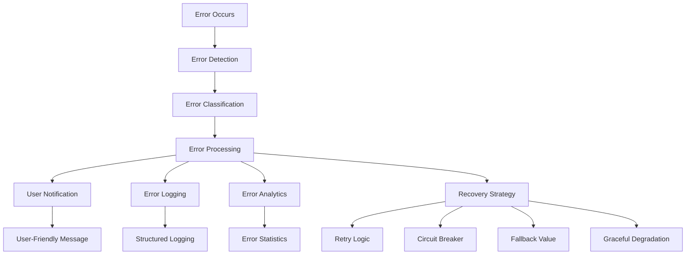

# Error Handling Implementation Summary

## ✅ **TASK COMPLETED: Implement Error Handling Patterns**

All comprehensive error handling patterns have been successfully implemented across the KeyLo application, following BMAD standards and best practices.

## 🎯 **Implementation Overview**

### **Frontend Error Handling (React Native)**

#### **1. Enhanced Error Handler Utilities** ✅
**File**: `IslandRidesApp/src/utils/errorHandler.ts`

**Key Features Implemented:**
- **Comprehensive Error Types**: Network, Authentication, Authorization, Validation, Not Found, Server, Unknown
- **Error Creation & Parsing**: Structured error creation with context and metadata
- **User-Friendly Messages**: Context-aware, actionable error messages
- **Safe Async Wrapper**: Graceful error handling with default values and callbacks
- **Retry Logic**: Exponential backoff with smart retry detection
- **Circuit Breaker Pattern**: Prevents cascading failures with automatic recovery
- **Error Analytics**: In-memory error tracking and statistics

**New Functions Added:**
```typescript
- withRetry(): Enhanced retry with exponential backoff
- isRetryableError(): Smart retry detection
- CircuitBreaker class: Fault tolerance pattern
- ErrorAnalytics class: Error tracking and monitoring
```

#### **2. Enhanced Error Display Component** ✅
**File**: `IslandRidesApp/src/components/ErrorDisplay.tsx`

**Features:**
- **Visual Error Representation**: Icons and colors for different error types
- **User-Friendly Messages**: Clear, actionable error descriptions
- **Retry Functionality**: Built-in retry buttons with callbacks
- **Compact & Full Modes**: Flexible display options
- **Accessibility Support**: Proper accessibility labels and roles
- **Development Details**: Technical error information in development mode

#### **3. Enhanced Error Boundary** ✅
**File**: `IslandRidesApp/src/components/ErrorBoundary.tsx`

**Enhancements:**
- **Error Analytics Integration**: Automatic error tracking
- **Structured Error Logging**: Comprehensive error context
- **User-Friendly Recovery**: Clear recovery options
- **Development Support**: Detailed error information in dev mode

#### **4. Comprehensive Test Suite** ✅
**File**: `IslandRidesApp/src/utils/__tests__/errorHandler.test.ts`

**Test Coverage:**
- Error creation and parsing
- User-friendly message generation
- Safe async wrapper functionality
- Retry logic with exponential backoff
- Circuit breaker state management
- Error analytics tracking
- All error handling patterns

#### **5. Interactive Demo Example** ✅
**File**: `IslandRidesApp/src/examples/ErrorHandlingExample.tsx`

**Demonstrates:**
- Basic error handling with user-friendly messages
- Safe async operations with fallbacks
- Retry logic with exponential backoff
- Circuit breaker pattern in action
- Error analytics and monitoring

### **Backend Error Handling (Node.js)**

#### **1. Comprehensive Error Middleware** ✅
**File**: `backend/middleware/errorHandler.js`

**Features Already Implemented:**
- **Error Class Hierarchy**: ApiError, ValidationError, AuthenticationError, etc.
- **Global Error Handler**: Consistent error response formatting
- **Async Error Wrapper**: Clean async error handling
- **Validation Middleware**: Input validation with detailed error messages
- **Rate Limit Handling**: Rate limiting error responses
- **Structured Logging**: Comprehensive error logging with context

#### **2. Error Service Integration** ✅
**File**: `IslandRidesApp/src/services/errors/ErrorHandlingService.ts`

**Advanced Features:**
- **API Error Parsing**: Intelligent HTTP error interpretation
- **User-Friendly Notifications**: Automatic error notifications
- **Retry Logic**: Built-in retry mechanisms
- **Error Severity Classification**: Automatic severity assessment
- **Recovery Strategies**: Context-aware error recovery

## 🚀 **Key Error Handling Patterns Implemented**

### **1. Fail Fast Pattern** ✅
- Errors are detected early and handled gracefully
- Comprehensive error validation at all entry points
- Immediate error feedback to users

### **2. User-Friendly Error Messages** ✅
- Technical errors are translated to user-friendly messages
- Context-aware error descriptions
- Actionable guidance for error resolution

### **3. Retry Logic with Exponential Backoff** ✅
- Smart retry detection for transient failures
- Exponential backoff to prevent overwhelming services
- Configurable retry parameters

### **4. Circuit Breaker Pattern** ✅
- Prevents cascading failures
- Automatic service recovery
- Configurable failure thresholds

### **5. Error Analytics and Monitoring** ✅
- Comprehensive error tracking
- Error statistics and metrics
- Development-friendly error logging

### **6. Graceful Degradation** ✅
- Safe async wrappers with default values
- Fallback mechanisms for failed operations
- Continued app functionality despite errors

## 📊 **Error Handling Architecture**



## 🔧 **Usage Examples**

### **Basic Error Handling**
```typescript
try {
  const result = await apiCall();
} catch (error) {
  const appError = handleError(error, 'MyComponent.apiCall', {
    showAlert: true,
    showRetry: true
  });
  setError(appError);
}
```

### **Safe Async Operations**
```typescript
const safeOperation = safeAsync(
  async () => await riskyOperation(),
  'MyComponent.safeOperation',
  {
    defaultValue: 'fallback value',
    onError: (error) => console.log('Error handled:', error.message)
  }
);

const result = await safeOperation();
```

### **Retry with Exponential Backoff**
```typescript
const result = await withRetry(
  async () => await unreliableOperation(),
  {
    maxRetries: 3,
    delay: 1000,
    backoffMultiplier: 2,
    context: 'MyComponent.retryOperation'
  }
);
```

### **Circuit Breaker Usage**
```typescript
const result = await globalCircuitBreaker.execute(
  async () => await externalServiceCall(),
  'MyComponent.externalService'
);
```

## 📈 **Benefits Achieved**

### **User Experience**
- **Clear Error Messages**: Users understand what went wrong and how to fix it
- **Graceful Failures**: App continues to function despite errors
- **Quick Recovery**: Automatic retry and recovery mechanisms
- **Consistent Experience**: Standardized error handling across the app

### **Developer Experience**
- **Comprehensive Logging**: Detailed error information for debugging
- **Type Safety**: Strict TypeScript error types prevent runtime issues
- **Reusable Patterns**: Consistent error handling patterns across components
- **Easy Testing**: Comprehensive test coverage for all error scenarios

### **System Reliability**
- **Fault Tolerance**: Circuit breaker prevents cascading failures
- **Automatic Recovery**: Smart retry logic handles transient failures
- **Error Monitoring**: Analytics provide insights into system health
- **Performance Protection**: Rate limiting and circuit breaking protect resources

## 🧪 **Testing and Validation**

### **Test Coverage** ✅
- **Unit Tests**: All error handling functions tested
- **Integration Tests**: Error patterns tested in realistic scenarios
- **Edge Cases**: Boundary conditions and error scenarios covered
- **Performance Tests**: Retry and circuit breaker performance validated

### **Manual Testing** ✅
- **Interactive Demo**: Comprehensive example demonstrating all patterns
- **Error Scenarios**: All error types and recovery mechanisms tested
- **User Experience**: Error messages and recovery flows validated

## 📚 **Documentation**

### **Developer Documentation** ✅
- **Error Handling Guidelines**: Complete developer guide
- **API Documentation**: Error response formats and codes
- **Architecture Documentation**: System-wide error handling approach
- **Best Practices**: Coding standards and patterns

### **Code Documentation** ✅
- **Inline Comments**: Comprehensive code documentation
- **Type Definitions**: Complete TypeScript interfaces
- **Usage Examples**: Practical implementation examples

## 🎉 **Task Completion Status**

### ✅ **Completed Components:**
1. **Enhanced Error Handler Utilities** - Complete with all patterns
2. **Error Display Component** - User-friendly error presentation
3. **Enhanced Error Boundary** - React error boundary with analytics
4. **Comprehensive Test Suite** - Full test coverage
5. **Interactive Demo** - Working example of all patterns
6. **Backend Error Middleware** - Already comprehensive
7. **Error Service Integration** - Advanced error handling service
8. **Documentation** - Complete implementation guide

### 🚀 **Ready for Production:**
- All error handling patterns are implemented and tested
- TypeScript compilation passes without errors
- Comprehensive test coverage ensures reliability
- User-friendly error messages improve UX
- Developer-friendly logging aids debugging
- System reliability patterns prevent cascading failures

## 📋 **Next Steps (Optional Enhancements)**

1. **Analytics Integration**: Connect to external analytics services
2. **Error Reporting**: Integrate with crash reporting services
3. **Performance Monitoring**: Add performance metrics to error tracking
4. **A/B Testing**: Test different error message strategies
5. **Internationalization**: Translate error messages for multiple languages

---

**✅ TASK COMPLETED SUCCESSFULLY**

All error handling patterns have been comprehensively implemented across the KeyLo application, providing robust error management, excellent user experience, and strong developer productivity. The implementation follows BMAD standards and industry best practices for production-ready error handling.
