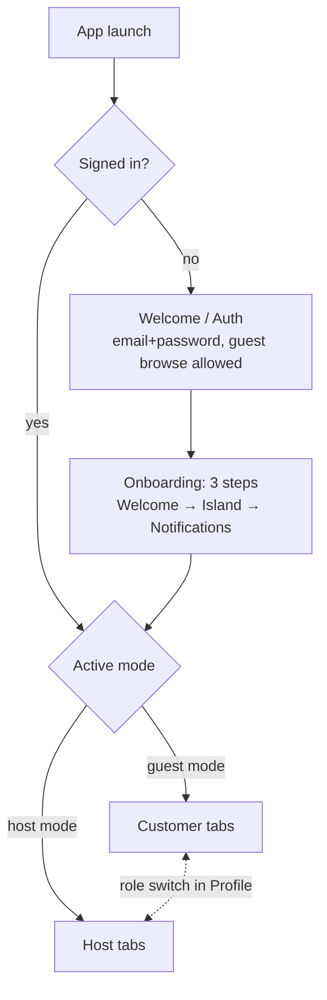
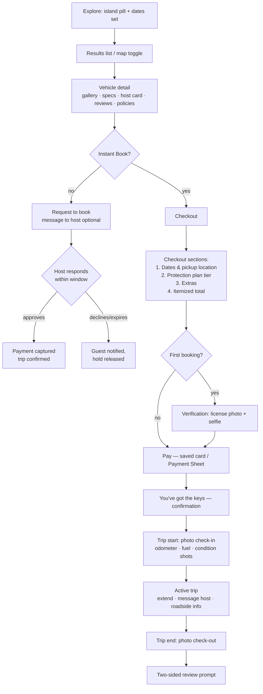
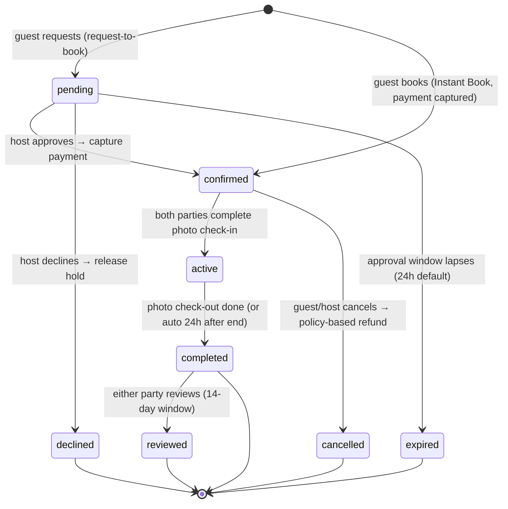
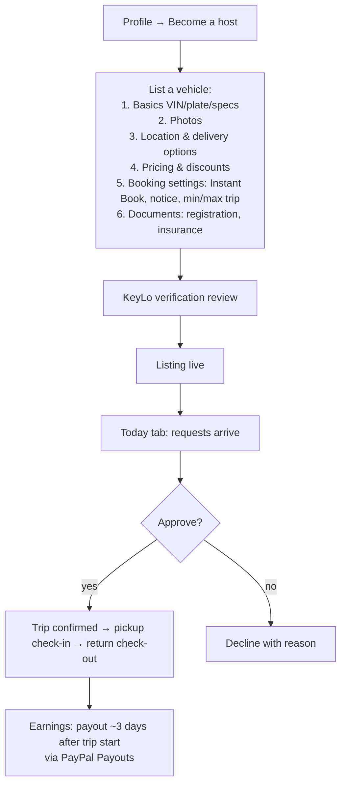
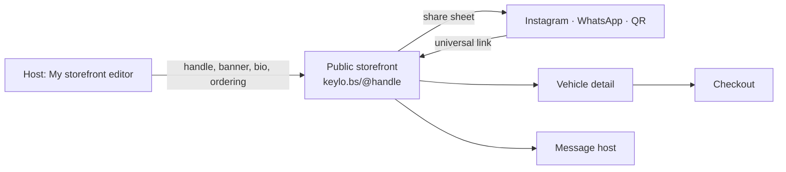

# 02 · User Flows & Information Architecture

KeyLo functions like Turo — the same marketplace mechanics — reorganized from the current ~40 screens into a clean two-role IA. The old routes this replaces live in `src/navigation/routes.ts`; the old→new mapping is in [03-screen-inventory.md](03-screen-inventory.md).

## Top-level IA

Everyone starts as a **guest** (browsing requires no account; booking requires sign-in + verification). "Become a host" lives in Profile — there is no role-selection gate at onboarding, and the old `user/host/owner/admin` roles collapse to `user | host | admin` (host is an upgrade, owner merges into host).

### Customer tabs
| Tab | Contents | Replaces |
|---|---|---|
| **Explore** | Search bar + island filter pill + date pill; segmented list/map results; vehicle detail | IslandSelection, Search, SearchResults, Map |
| **Trips** | Upcoming / active / past trips; trip detail with check-in, receipts, review CTA | MyBookings, PaymentHistory |
| **Inbox** | Conversations + notification center | Chat, notifications |
| **Profile** | Account, verification status, favorites, saved searches, settings, "Become a host" / "Switch to hosting" | Profile, Favorites, SavedSearches, NotificationPreferences |

### Host tabs (after switching modes)
| Tab | Contents | Replaces |
|---|---|---|
| **Today** | Action queue: booking requests to approve, today's pickups/returns, alerts | HostDashboard + OwnerDashboard (merged) |
| **Fleet** | Vehicle list → single **Vehicle Manager** with sections: Photos, Calendar & pricing, Booking settings, Documents, Condition | FleetManagement + VehiclePhotoUpload + VehicleAvailability + VehicleDocumentManagement + VehicleConditionTracker |
| **Bookings** | Request/upcoming/active/past bookings; trip check-in from the host side | host bookings screens |
| **Earnings** | Balance, payout schedule, per-vehicle performance, reports | FinancialReports + VehiclePerformance |

## Guest booking flow (the money path)

Pickup location options at checkout: host's location (free), airport pickup (host-set fee), or delivery to a hotel/address within the host's delivery radius (host-set fee) — all already modeled on `Vehicle` (`airportPickup`, `deliveryFee`, `deliveryRadius`).

**Flight-aware pickups:** choosing airport pickup asks for an optional flight number. The host's Today schedule shows it next to the pickup ("AA1043 · on time"), and a delayed flight shifts the expected pickup time instead of triggering a no-show — most KeyLo guests are landing at LPIA, so this is the highest-leverage service detail in the flow.

## Booking lifecycle (state machine)

**Payment states are tracked separately** on the Payment record: `requires_payment → authorized (hold) → captured → refunded / partially_refunded`. Request-to-book authorizes at request time and captures on approval; Instant Book captures immediately.

## Turo-parity mechanics

- **Instant Book** is a per-vehicle toggle (already `Vehicle.instantBooking`); off means request-to-book with a host approval window (default 24h, host-configurable 8–24h) after which the request auto-expires.
- **Trip check-in / check-out:** at pickup both parties photograph condition, odometer, and fuel level in-app; mirrored at return. These photos gate the `active`/`completed` transitions and are the evidence record for damage disputes.
  - **Drive-side primer:** for first-time and foreign guests, check-in opens with a dismissible primer card — "🇧🇸 We drive on the **left** in the Bahamas" — stating whether this car is LHD or RHD and what that means for the driver. RHD/LHD also remains a search filter chip.
  - **Offline-tolerant:** check-in/out must work with no signal (Family Island coverage is spotty). Photos and odometer/fuel readings queue on-device, the trip is allowed to start on queued evidence, and uploads sync automatically when connectivity returns.
- **Protection plans:** at checkout the guest picks a tier — Minimum / Standard / Premium — with decreasing deductible, priced as a percentage of the trip subtotal. Hosts pick a host plan that sets their earnings split (75/80/90%). v1 models these as platform "plans" (fees + deductibles); underwriting/insurer integration is explicitly out of scope.
- **Cancellation policy (platform-standard):** free cancellation until 24h before trip start; 50% refund of trip cost inside 24h; no refund after start. Host cancellations auto-refund 100% and ding host metrics. No-shows: guest no-show = no refund after 2h grace; host no-show = full refund + rebooking help.
- **Trip modification:** guest can request an extension mid-trip; system reprices, host approves (auto-approve if calendar is free and Instant Book on), delta is captured as an additional Payment.
- **Verification:** driver's-license photo + selfie captured at first booking (or from Profile). Verification provider deferred (a dedicated ID-verification service later; manual admin review at launch); the flow and `verificationStatus` field are designed now.
- **Pricing engine:** daily rate × nights, minus host weekly/monthly discounts, plus extras, delivery/airport fee, young-driver fee (under 25), protection plan, and the KeyLo service fee (guest side). Checkout always shows the itemized breakdown.
- **Reviews:** two-sided, blind (revealed when both submit or after 14 days), only for `completed` trips.

## Host flows

Host calendar per vehicle: blocked dates, trip holds, seasonal price overrides (existing `VehicleAvailability.priceOverride`). Bulk rate update becomes an action sheet on Fleet (multi-select), not a screen.

### Host storefronts (shareable)

Every host gets a public, branded **storefront** — their marketing page inside and outside KeyLo:

- **Claimable handle** → a canonical URL: `keylo.bs/@daniellesfleet`. The same link opens the web build or deep-links into the app (Expo universal links; `linking.ts` already exists).
- **Contents:** banner image, avatar/monogram, display name, bio/tagline, stats (rating, trips, response time, All-Star tier), filterable fleet grid, and review highlights. Guests can message the host or jump into any listing.
- **Share:** a share button on the storefront (and in the host's own Today/Profile) opens the native share sheet — hosts drop their link on Instagram, WhatsApp, business cards. Booking pages attribute `via storefront` for host analytics.
- **Editing:** hosts manage it from a **My storefront** editor in host mode: handle (unique, changeable with old-handle redirect), banner, bio, featured vehicle, fleet ordering.
- **QR code:** the editor generates a downloadable QR of the storefront URL — print it on business cards, flyers, or a hotel lobby stand. Scans attribute as `source=qr` in storefront stats.
- **SEO:** on web, storefronts render with OpenGraph tags (banner, name, rating) so shared links unfurl nicely in chats and socials.

## Onboarding (3 steps, down from 5)

1. **Welcome** — one screen, brand moment, sign in / create account / browse first.
2. **Island** — "Where are you renting?" (Nassau / Freeport / Exuma) — sets the default Explore filter, changeable anytime.
3. **Notifications** — permission prompt with a reason (booking updates, host replies).

Role selection is cut (everyone is a guest); location permission is requested contextually the first time the map is opened, not during onboarding.
