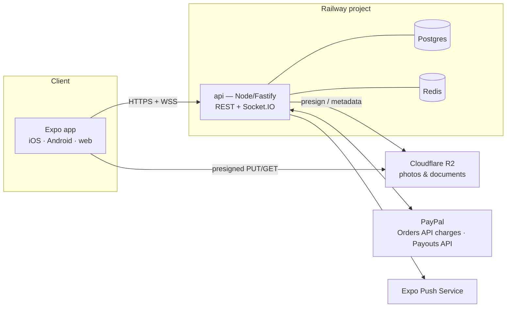

# 04 · Backend Architecture — Railway

The app currently points at APIs that don't exist (`EXPO_PUBLIC_API_BASE_URL=http://localhost:3000`, WS at `:3001`, fallback `:3003/api`). This is the design for the real backend, deployed on **Railway**, serving the Expo app on iOS, Android, and web from one API.

## Topology



| Piece | Choice | Why |
|---|---|---|
| Compute | Single Railway service `api` | One deployable; workers run in-process via BullMQ until scale demands a split |
| Database | Railway Postgres | Relational marketplace data (bookings, money) wants Postgres |
| Cache/queue | Railway Redis | Socket.IO adapter, rate limiting, BullMQ jobs (request expiry, payout scheduling, push fan-out) |
| Object storage | **Cloudflare R2** | Railway has no native object store; R2 is S3-compatible with zero egress fees. Uploads go client → R2 via presigned URLs so photo traffic never transits the API |
| Framework | **Fastify + TypeScript + Zod** (`fastify-type-provider-zod`) | Lighter than NestJS, first-class schema validation, typed routes; modular routers mirror the app's `src/services/domains/*` |
| ORM | **Prisma** | Best migrations + DX story for a rebuild; schema sketch in [06-data-model.md](06-data-model.md) |
| Realtime | **Socket.IO** server + Redis adapter | The app already ships `socket.io-client`; namespaces `/chat` and `/bookings` (status transitions pushed live) |
| Payments | **PayPal** (interim) | See decision below |
| Push | **Expo Push** via `expo-server-sdk` | Tokens stored per device (`PushToken` table); no FCM/APNs plumbing needed |

## Environment (Railway service variables)

```
DATABASE_URL, REDIS_URL            # injected by Railway plugins
JWT_SECRET, JWT_REFRESH_SECRET
R2_ACCOUNT_ID, R2_ACCESS_KEY_ID, R2_SECRET_ACCESS_KEY, R2_BUCKET
STRIPE_SECRET_KEY, STRIPE_WEBHOOK_SECRET, STRIPE_CONNECT_CLIENT_ID
EXPO_ACCESS_TOKEN                  # push
APP_ORIGIN                         # CORS for web build
```

Client side: `EXPO_PUBLIC_API_BASE_URL=https://api.<railway-domain>` and `EXPO_PUBLIC_WS_URL=wss://api.<railway-domain>` replace the localhost values in `.env`.

## Auth

- Email + password, hashed with **argon2id**.
- **JWT access token (15 min)** + **rotating refresh token (30 days, single-use, stored hashed)**. Native: SecureStore. Web: httpOnly cookie for refresh.
- Roles: `user | host | admin` (`owner` merged into host; matches screen merge in 03). Host is a flag-upgrade on the same account, not a separate login.
- The app's existing axios interceptor pattern (`src/services/apiService.ts` token refresh/retry) maps directly onto this.
- Social login deferred; `AuthProvider` table reserves room.
- Guest browsing: search/detail endpoints are public; booking, chat, favorites require auth; verification (license + selfie) required before first booking completes.

## Payments — PayPal (interim decision)

**The payment rail is deliberately an interim call: PayPal for now, revisited before scale.** The design keeps every payment-touching interface gateway-neutral (`gateway` + `gatewayRef` fields, a single `PaymentGateway` module in the API) so switching later is a migration, not a redesign.

- **Charges:** **PayPal Orders API v2**, approved in-app via an in-app-browser sheet (the app already has PayPal screens/flows to draw on). Request-to-book = order created with `intent=AUTHORIZE` (authorize at request, capture on host approval, void on decline/expiry). Instant Book = `intent=CAPTURE` immediately. Cards work through PayPal's guest checkout — no PayPal account required.
- **Refunds:** Captures API refunds (full or partial) against the original capture, driven by the cancellation policy in 02.
- **Host payouts:** **PayPal Payouts API** to the host's PayPal email, ~3 days after trip start, driven by an **internal earnings ledger** (PayPal has no Connect-style split-payment platform product, so KeyLo receives full payment and owes hosts their split — the `Payout` table is that ledger).
- **Currency:** USD (1:1 with BSD, both circulate in the Bahamas). Display "$".
- **Webhooks:** `/payments/webhook` verifies PayPal webhook signatures and handles capture, refund, and payout events; the webhook is the source of truth for payment state.
- **Known limitations to revisit:** authorization holds expire after ~29 days and honor periods are shorter (long-lead bookings need re-authorization near trip start — a BullMQ job); deposit "holds" are modeled as authorizations with the same constraint; and the earnings ledger makes KeyLo the merchant of record. A future move (e.g. Stripe Connect if entity structure allows, or a local processor) slots in behind the `PaymentGateway` module.

## Background jobs (BullMQ on Redis)

| Job | Schedule |
|---|---|
| Expire pending booking requests (release auth hold) | delayed job per request (default 24h) |
| Schedule host payout after trip start | delayed job per booking |
| Auto-complete trips 24h after end if no check-out | delayed job per trip |
| Reveal blind reviews at 14 days | delayed job per review pair |
| Push notification fan-out | immediate queue |

## Security & ops baseline

- Zod validation on every route; rate limiting via Redis (`@fastify/rate-limit`); helmet-equivalent headers; CORS locked to `APP_ORIGIN`.
- Booking state transitions enforced server-side by a single state-machine module (the diagram in 02 is the spec) — clients can only *request* transitions.
- Idempotency keys on booking creation and payment endpoints.
- **Offline check-in support:** the check-in/out endpoints accept inspection metadata without photos, then photo keys via PATCH as the client's upload queue drains (Family Island connectivity). The client keeps a persistent retry queue for presigned R2 uploads; the state machine treats a metadata-complete inspection as sufficient to transition, with photos marked `pending sync` until `syncedAt` is set.
- Structured logs (pino) to Railway logs; `/health` endpoint for Railway healthchecks.
- Prisma migrations run on deploy (`railway run` release phase).

## What the app keeps

The rebuild keeps the app's service-layer shape: `src/services/domains/{Vehicle,Booking,Payment,User,Host}Service.ts` map 1:1 onto the API routers in [05-api-spec.md](05-api-spec.md), so the client refactor is mostly re-pointing methods at real endpoints rather than re-architecting.
