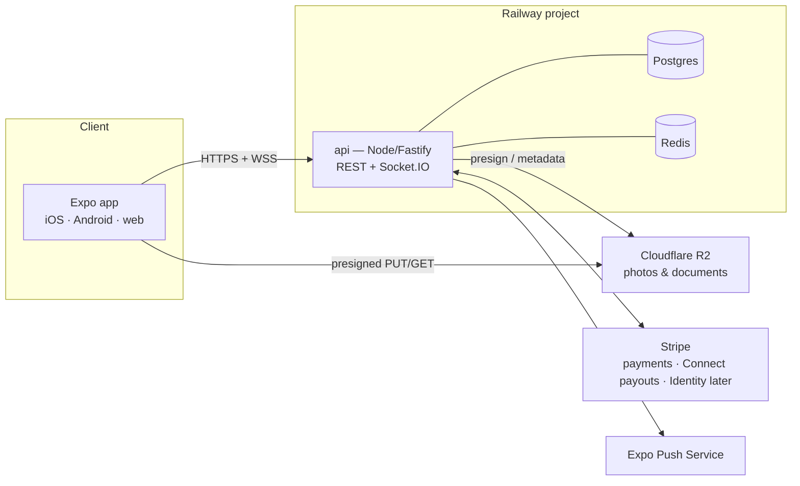

# 04 · Backend Architecture — Railway

The app currently points at APIs that don't exist (`EXPO_PUBLIC_API_BASE_URL=http://localhost:3000`, WS at `:3001`, fallback `:3003/api`). This is the design for the real backend, deployed on **Railway**, serving the Expo app on iOS, Android, and web from one API.

## Topology



| Piece | Choice | Why |
|---|---|---|
| Compute | Single Railway service `api` | One deployable; workers run in-process via BullMQ until scale demands a split |
| Database | Railway Postgres | Relational marketplace data (bookings, money) wants Postgres |
| Cache/queue | Railway Redis | Socket.IO adapter, rate limiting, BullMQ jobs (request expiry, payout scheduling, push fan-out) |
| Object storage | **Cloudflare R2** | Railway has no native object store; R2 is S3-compatible with zero egress fees. Uploads go client → R2 via presigned URLs so photo traffic never transits the API |
| Framework | **Fastify + TypeScript + Zod** (`fastify-type-provider-zod`) | Lighter than NestJS, first-class schema validation, typed routes; modular routers mirror the app's `src/services/domains/*` |
| ORM | **Prisma** | Best migrations + DX story for a rebuild; schema sketch in [06-data-model.md](06-data-model.md) |
| Realtime | **Socket.IO** server + Redis adapter | The app already ships `socket.io-client`; namespaces `/chat` and `/bookings` (status transitions pushed live) |
| Payments | **Stripe** | See decision below |
| Push | **Expo Push** via `expo-server-sdk` | Tokens stored per device (`PushToken` table); no FCM/APNs plumbing needed |

## Environment (Railway service variables)

```
DATABASE_URL, REDIS_URL            # injected by Railway plugins
JWT_SECRET, JWT_REFRESH_SECRET
R2_ACCOUNT_ID, R2_ACCESS_KEY_ID, R2_SECRET_ACCESS_KEY, R2_BUCKET
STRIPE_SECRET_KEY, STRIPE_WEBHOOK_SECRET, STRIPE_CONNECT_CLIENT_ID
EXPO_ACCESS_TOKEN                  # push
APP_ORIGIN                         # CORS for web build
```

Client side: `EXPO_PUBLIC_API_BASE_URL=https://api.<railway-domain>` and `EXPO_PUBLIC_WS_URL=wss://api.<railway-domain>` replace the localhost values in `.env`.

## Auth

- Email + password, hashed with **argon2id**.
- **JWT access token (15 min)** + **rotating refresh token (30 days, single-use, stored hashed)**. Native: SecureStore. Web: httpOnly cookie for refresh.
- Roles: `user | host | admin` (`owner` merged into host; matches screen merge in 03). Host is a flag-upgrade on the same account, not a separate login.
- The app's existing axios interceptor pattern (`src/services/apiService.ts` token refresh/retry) maps directly onto this.
- Social login deferred; `AuthProvider` table reserves room.
- Guest browsing: search/detail endpoints are public; booking, chat, favorites require auth; verification (license + selfie) required before first booking completes.

## Payments — Stripe (decision)

**Recommendation: Stripe, and deprecate the PayPal/crypto/bank-transfer screens.**

- **Charges:** Stripe Payment Intents via the Expo **Payment Sheet** (`@stripe/stripe-react-native`). Request-to-book = manual-capture intent (authorize at request, capture on host approval, auto-release on decline/expiry). Instant Book = immediate capture.
- **Host payouts:** **Stripe Connect Express** accounts per host; payout ~3 days after trip start; KeyLo's platform fee and the host plan split applied via `application_fee_amount`.
- **Currency:** USD (1:1 with BSD, both circulate in the Bahamas). Display "$".
- **Webhooks:** `/payments/webhook` handles capture, refund, payout, and dispute events; webhook is the source of truth for payment state.
- *Fallback if PayPal must stay:* keep PayPal Orders API for charges only — but you lose manual capture ergonomics and Connect-style payouts, and must build a manual payout ledger. Not recommended.

Refund math follows the cancellation policy in 02 and is executed as Stripe refunds (full or partial) against the original intent.

## Background jobs (BullMQ on Redis)

| Job | Schedule |
|---|---|
| Expire pending booking requests (release auth hold) | delayed job per request (default 24h) |
| Schedule host payout after trip start | delayed job per booking |
| Auto-complete trips 24h after end if no check-out | delayed job per trip |
| Reveal blind reviews at 14 days | delayed job per review pair |
| Push notification fan-out | immediate queue |

## Security & ops baseline

- Zod validation on every route; rate limiting via Redis (`@fastify/rate-limit`); helmet-equivalent headers; CORS locked to `APP_ORIGIN`.
- Booking state transitions enforced server-side by a single state-machine module (the diagram in 02 is the spec) — clients can only *request* transitions.
- Idempotency keys on booking creation and payment endpoints.
- Structured logs (pino) to Railway logs; `/health` endpoint for Railway healthchecks.
- Prisma migrations run on deploy (`railway run` release phase).

## What the app keeps

The rebuild keeps the app's service-layer shape: `src/services/domains/{Vehicle,Booking,Payment,User,Host}Service.ts` map 1:1 onto the API routers in [05-api-spec.md](05-api-spec.md), so the client refactor is mostly re-pointing methods at real endpoints rather than re-architecting.
