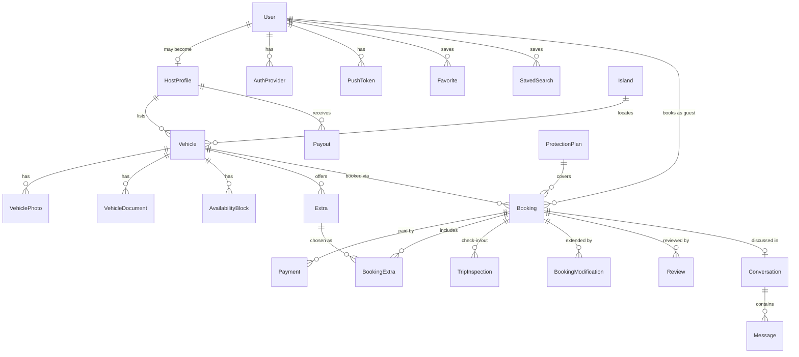

# 06 · Data Model

Postgres via Prisma. Fields are grounded in the app's existing types (`src/types/index.ts` — `Vehicle`, `User`, `SearchFilters`, payment types) plus the Turo-parity mechanics from 02. Money is integer cents, USD.

## ER overview



## Prisma schema sketch

Key models with their load-bearing fields (not exhaustive — timestamps/indexes implied):

```prisma
enum Role { user host admin }
enum VerificationStatus { unverified pending verified rejected }
enum BookingStatus { pending confirmed active completed reviewed cancelled declined expired }
enum PaymentStatus { requires_payment authorized captured refunded partially_refunded failed }
enum DriveSide { LHD RHD }

model User {
  id                 String   @id @default(cuid())
  email              String   @unique
  passwordHash       String
  firstName          String
  lastName           String
  role               Role     @default(user)
  phoneNumber        String?
  avatarKey          String?              // R2 key
  preferredIslandId  String?
  dateOfBirth        DateTime?            // young-driver fee
  verificationStatus VerificationStatus @default(unverified)
  licenseKey         String?              // R2 key, license photo
  selfieKey          String?
  failedLoginAttempts Int     @default(0)
  lockoutUntil       DateTime?
  deletedAt          DateTime?            // soft delete
  hostProfile        HostProfile?
}

model AuthProvider {                       // reserved for social login
  id           String @id @default(cuid())
  userId       String
  provider     String                      // "google" | "apple"
  providerId   String
  @@unique([provider, providerId])
}

model HostProfile {
  id                String  @id @default(cuid())
  userId            String  @unique
  // storefront (public, shareable at keylo.bs/@handle)
  handle            String? @unique             // claimable; old handles kept in HandleRedirect
  displayName       String?                     // "Danielle's Island Fleet"
  tagline           String?
  bannerKey         String?                     // R2 key
  featuredVehicleId String?
  fleetOrder        String[]                    // vehicle ids, storefront display order
  bio               String?
  responseTimeMins  Int?
  planTier          String  @default("standard")  // sets earnings split 75/80/90
  earningsSplitBps  Int     @default(8000)
  paypalPayerEmail  String?                       // PayPal Payouts destination (interim rail)
  payoutEnabled     Boolean @default(false)
  suspendedAt       DateTime?
}

model Island {
  id       String @id                     // "nassau" | "freeport" | "exuma" — seeded from src/constants/islands.ts
  name     String                         // "New Providence (Nassau)"
  features String[]
  active   Boolean @default(true)
}

model Vehicle {
  id               String    @id @default(cuid())
  hostId           String
  islandId         String
  make             String
  model            String
  year             Int
  vehicleType      String                 // sedan|suv|truck|van|convertible|coupe|hatchback
  driveSide        DriveSide
  seats            Int
  doors            Int?
  transmission     String?
  fuelType         String?
  color            String?
  licensePlate     String?
  vin              String?
  mileage          Int?
  description      String?
  // pricing
  dailyRateCents   Int
  weeklyDiscountBps  Int @default(0)
  monthlyDiscountBps Int @default(0)
  securityDepositCents Int @default(0)
  youngDriverFeeCents  Int @default(0)
  // location & delivery
  address          String?
  latitude         Float?
  longitude        Float?
  deliveryAvailable Boolean @default(false)
  deliveryFeeCents Int      @default(0)
  deliveryRadiusKm Int      @default(0)
  airportPickup    Boolean  @default(false)
  airportFeeCents  Int      @default(0)
  // booking settings (Turo parity)
  instantBook      Boolean  @default(false)
  advanceNoticeHrs Int      @default(12)
  minTripDays      Int      @default(1)
  maxTripDays      Int      @default(30)
  approvalWindowHrs Int     @default(24)
  // lifecycle
  verificationStatus VerificationStatus @default(pending)
  listedAt         DateTime?
  unlistedAt       DateTime?
}

model VehiclePhoto {
  id        String  @id @default(cuid())
  vehicleId String
  key       String                        // R2 key
  kind      String  @default("exterior")  // exterior|interior|dashboard|trunk|other
  position  Int
  isPrimary Boolean @default(false)
}

model VehicleDocument {
  id        String @id @default(cuid())
  vehicleId String
  kind      String                        // registration|insurance|inspection
  key       String
  expiresAt DateTime?
  status    VerificationStatus @default(pending)
}

model AvailabilityBlock {
  id            String   @id @default(cuid())
  vehicleId     String
  startDate     DateTime @db.Date
  endDate       DateTime @db.Date
  kind          String                    // blocked | price_override | trip_hold
  priceOverrideCents Int?
  bookingId     String?                   // for trip_hold
}

model Extra {                             // host-defined add-ons: child seat, cooler, beach kit
  id          String @id @default(cuid())
  vehicleId   String
  name        String
  priceCents  Int
  perTrip     Boolean @default(true)      // false = per day
  active      Boolean @default(true)
}

model ProtectionPlan {                    // platform-defined guest tiers
  id             String @id               // "minimum" | "standard" | "premium"
  name           String
  feeBps         Int                      // % of trip subtotal
  deductibleCents Int
  active         Boolean @default(true)
}

model Booking {
  id               String        @id @default(cuid())
  guestId          String
  vehicleId        String
  status           BookingStatus @default(pending)
  startAt          DateTime
  endAt            DateTime
  pickupKind       String                 // host_location | airport | delivery
  pickupAddress    String?
  flightNumber     String?                // airport pickups: host sees delays, pickup time follows the flight
  // itemized pricing snapshot (immutable once confirmed)
  nightlyRateCents Int
  nights           Int
  durationDiscountCents Int @default(0)
  extrasCents      Int @default(0)
  deliveryCents    Int @default(0)
  youngDriverCents Int @default(0)
  protectionPlanId String
  protectionCents  Int
  serviceFeeCents  Int                    // KeyLo guest-side fee
  totalCents       Int
  hostEarningsCents Int
  // request-to-book
  requestMessage   String?
  approvalDeadline DateTime?
  declineReason    String?
  cancelledBy      String?                // guest | host
  cancellationRefundCents Int?
}

model BookingExtra {
  id        String @id @default(cuid())
  bookingId String
  extraId   String
  priceCentsSnapshot Int
}

model TripInspection {                    // Turo-style check-in / check-out
  id         String   @id @default(cuid())
  bookingId  String
  phase      String                       // check_in | check_out
  party      String                       // guest | host
  odometer   Int?
  fuelLevel  Int?                         // 0–100
  photoKeys  String[]                     // R2 keys: 4 corners + dash; may arrive after submittedAt (offline queue)
  notes      String?
  submittedAt DateTime @default(now())
  syncedAt   DateTime?                    // null while photos are queued on-device awaiting connectivity
  @@unique([bookingId, phase, party])
}

model BookingModification {               // trip extensions
  id          String @id @default(cuid())
  bookingId   String
  newEndAt    DateTime
  deltaCents  Int
  status      String                      // requested | approved | declined | expired
  paymentId   String?
}

model Payment {
  id              String        @id @default(cuid())
  bookingId       String
  status          PaymentStatus @default(requires_payment)
  amountCents     Int
  refundedCents   Int           @default(0)
  gateway         String        @default("paypal") // gateway-neutral: switching rails later is a migration, not a redesign
  gatewayRef      String?       @unique            // PayPal order/capture id today
  kind            String        @default("trip")   // trip | extension | deposit
}

model Payout {
  id              String  @id @default(cuid())
  hostId          String
  bookingId       String?
  amountCents     Int
  status          String                  // scheduled | paid | failed
  gatewayBatchRef String?                 // PayPal Payouts batch id today
  scheduledFor    DateTime
}

model Review {                            // two-sided, blind
  id         String  @id @default(cuid())
  bookingId  String
  authorId   String
  targetKind String                       // vehicle | guest
  rating     Int                          // 1–5
  body       String?
  publishedAt DateTime?                   // null until both submit or 14-day reveal
  hostResponse String?
  @@unique([bookingId, authorId])
}

model Conversation {
  id         String  @id @default(cuid())
  bookingId  String? @unique
  vehicleId  String?                      // pre-booking inquiry
  guestId    String
  hostId     String
}

model Message {
  id             String   @id @default(cuid())
  conversationId String
  senderId       String
  body           String
  readAt         DateTime?
}

model Favorite {
  userId    String
  vehicleId String
  @@id([userId, vehicleId])
}

model SavedSearch {
  id      String @id @default(cuid())
  userId  String
  name    String
  filters Json                            // mirrors SearchFilters in src/types
}

model PushToken {
  id       String @id @default(cuid())
  userId   String
  token    String @unique                 // Expo push token
  platform String                         // ios | android | web
}

model HandleRedirect {                    // old storefront handles 301 to the current one
  oldHandle String @id
  hostId    String
}

model StorefrontVisit {                   // share attribution (privacy-light: counts, not identities)
  id        String   @id @default(cuid())
  hostId    String
  source    String?                       // share_sheet | qr | direct
  visitedAt DateTime @default(now())
}

model RefreshToken {
  id        String   @id @default(cuid())
  userId    String
  tokenHash String   @unique
  expiresAt DateTime
  revokedAt DateTime?
}
```

## Design notes

- **Islands are a table, not an enum** — the current `Island` union type (`'Nassau'|'Freeport'|'Exuma'`) means adding Eleuthera requires an app release; a seeded table means it's a row insert.
- **Pricing is snapshotted onto Booking** — quotes are computed live (`POST /bookings/quote`) but frozen at booking time so later rate changes never alter a receipt.
- **Availability is derived**, not stored per-day: a vehicle is available for a range iff no overlapping `confirmed/active` Booking and no overlapping `blocked` AvailabilityBlock. `trip_hold` blocks are written on confirmation to make calendar queries cheap.
- **`TripInspection` uniqueness** (`bookingId, phase, party`) enforces exactly one check-in and one check-out per party, and the state machine requires both `check_in` rows to move to `active`.
- **Blind reviews** hinge on `publishedAt`: set by the 14-day BullMQ job or when the counterpart review lands, whichever first.
- **IDs are cuids/strings**, replacing the app's numeric ids — the client types get updated in the code phase (`src/types/index.ts` uses `number` today).
- Migration path from existing types: `Vehicle.available` → derived; `conditionRating`/maintenance fields → deferred to a later fleet-ops iteration (kept out of v1 schema on purpose); `VehicleFeature`/`VehicleAmenity` tables → replaced by a simple `features String[]` on Vehicle in v1 plus host `Extra`s for anything priced.
