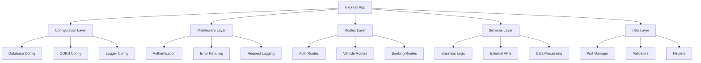
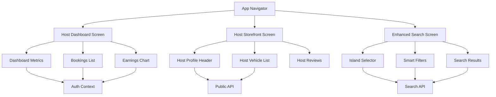

# KeyLo System Architecture

## Introduction

This document outlines the comprehensive system architecture for KeyLo, a peer-to-peer vehicle rental platform for the Bahamas. Following BMAD (Business Model Analysis and Design) standards, this architecture reflects the systematic improvements implemented to create a modular, scalable, and maintainable system.

**Architecture Philosophy:**
KeyLo follows a modular architecture pattern with clear separation of concerns, comprehensive error handling, and strict type safety. The system is designed for scalability, maintainability, and developer productivity.

### Change Log

| Change | Date | Version | Description | Author |
|--------|------|---------|-------------|--------|
| Systematic Improvements | 2025-01-23 | 3.0 | Modularized backend, TypeScript strict mode, error handling patterns | System Architect |
| Brownfield Enhancement | 2025-01-27 | 2.0 | Updated brownfield architecture for current project state | Scrum Master Bob |
| Legacy Version | 2025-07-15 | 1.0 | Initial architecture for enhancement epic | Winston, the Architect |

## System Overview

### Current Architecture State

- **Primary Purpose:** Peer-to-peer vehicle rental platform for the Bahamas
- **Architecture Pattern:** Modular, scalable architecture with systematic improvements
- **Tech Stack:** React Native (Expo) + TypeScript (strict mode), Modularized Node.js/Express backend
- **Database Strategy:** PostgreSQL (production) / SQLite (development) with intelligent connection management
- **Authentication:** JWT with comprehensive audit logging and role-based access control

### Architectural Improvements Implemented

- **Backend Modularization:** Separated monolithic server into focused modules (config, middleware, routes, utils)
- **TypeScript Enhancement:** Strict mode enabled with comprehensive type definitions and path mapping
- **Error Handling:** Centralized error management patterns across frontend and backend
- **Project Structure:** Clean, organized workspace with removed duplicates and proper dependency management
- **Smart Infrastructure:** Intelligent port management, structured logging, and comprehensive monitoring

### System Constraints and Design Decisions

- **Backward Compatibility:** All improvements maintain compatibility with existing functionality
- **Technology Consistency:** Uses existing React Native/Node.js stack without introducing new core technologies
- **Modular Design:** Clear separation of concerns with focused, single-responsibility modules
- **Type Safety:** Strict TypeScript configuration ensures compile-time error detection
- **Error Resilience:** Comprehensive error handling with user-friendly messages and retry logic

## Enhancement Scope and Integration Strategy

### Enhancement Overview

**Enhancement Type:** Significant Feature Addition & Architecture Modernization
**Scope:** Host management dashboard, public storefronts, island-aware search, document verification system
**Integration Impact:** High - requires database schema changes, new API endpoints, and multiple new screens

### Integration Approach

**Code Integration Strategy:** Incremental feature addition following existing patterns, maintaining backward compatibility
**Database Integration:** Schema migrations for new tables and columns, maintaining existing data integrity
**API Integration:** New RESTful endpoints following existing authentication and error handling patterns
**UI Integration:** New screens and components following established React Native patterns and theme system

### Compatibility Requirements

- **Existing API Compatibility:** All new endpoints must not break existing frontend API calls
- **Database Schema Compatibility:** Migrations must be backward-compatible with existing data
- **UI/UX Consistency:** New components must follow existing theme system and design patterns
- **Performance Impact:** New features must not degrade existing app performance

## Modular Backend Architecture

### Architecture Overview

The backend has been systematically modularized from a monolithic structure into focused, maintainable modules:



### Modular Components

#### Configuration Layer (`backend/config/`)
- **database.js**: Intelligent database connection management (PostgreSQL/SQLite)
- **cors.js**: Environment-aware CORS configuration with origin validation
- **logger.js**: Winston-based structured logging with multiple transports

#### Middleware Layer (`backend/middleware/`)
- **auth.js**: JWT authentication with comprehensive audit logging
- **errorHandler.js**: Centralized error handling with consistent formatting
- **validation.js**: Input validation with detailed error messages

#### Routes Layer (`backend/routes/`)
- **auth.js**: Authentication endpoints with rate limiting and validation
- **index.js**: Route aggregator for modular organization
- **[feature].js**: Feature-specific routes following consistent patterns

#### Utils Layer (`backend/utils/`)
- **portManager.js**: Smart port management with automatic conflict resolution
- **validators.js**: Reusable validation utilities
- **helpers.js**: Common utility functions

### Technology Stack (Enhanced)

| Category | Technology | Version | Enhancement | Notes |
|----------|------------|---------|-------------|-------|
| Frontend Framework | React Native (Expo) | ~49.0.0 | TypeScript strict mode | Enhanced type safety |
| Language | TypeScript | ^5.8.3 | Strict configuration | Path mapping, comprehensive types |
| Backend Framework | Node.js/Express | ^4.18.2 | Modular architecture | Separated concerns |
| Database (Dev) | SQLite | better-sqlite3 | Intelligent connection | Auto-initialization |
| Database (Prod) | PostgreSQL | pg package | Connection pooling | Error handling |
| Authentication | JWT | jsonwebtoken | Audit logging | Enhanced security |
| Logging | Winston | ^3.8.0 | Structured logging | Multiple transports |
| Error Handling | Custom Classes | Built-in | Centralized patterns | User-friendly messages |
| Port Management | Custom | Built-in | Smart detection | Conflict resolution |

## Data Models and Schema Changes

### New Data Models

#### Host Profile Model
**Purpose:** Store host-specific information for verified users
**Integration:** Extends existing user model with host capabilities

**Key Attributes:**
- `storefrontName`: string - Public business name for the host
- `bio`: string - Host description and background
- `profileImageURL`: string - Host profile photo URL
- `memberSince`: timestamp - Date when user became a host
- `isVerified`: boolean - Host verification status
- `verificationLevel`: string - "Standard" or "Pro" host level

**Relationships:**
- **With Existing:** One-to-one relationship with users table
- **With New:** One-to-many relationship with vehicles

#### Vehicle Documents Model
**Purpose:** Store legal document information for vehicle verification
**Integration:** Extends existing vehicles table with document tracking

**Key Attributes:**
- `titleURL`: string - Vehicle title document URL
- `insuranceURL`: string - Insurance certificate URL
- `titleVerified`: boolean - Admin verification status for title
- `insuranceVerified`: boolean - Admin verification status for insurance
- `lastDocumentUpdate`: timestamp - Last document modification date

**Relationships:**
- **With Existing:** One-to-one relationship with vehicles table
- **With New:** Links to host profile through vehicle ownership

#### User Identity Verification Model
**Purpose:** Store user identity verification documents and status
**Integration:** Extends existing user model with verification capabilities

**Key Attributes:**
- `verificationStatus`: string - "Not Submitted", "Pending", "Verified", "Rejected"
- `driverLicenseURL`: string - Driver's license document URL
- `nibCardURL`: string - NIB card document URL
- `lastVerifiedAt`: timestamp - Date of last successful verification
- `verificationNotes`: string - Admin notes on verification status

**Relationships:**
- **With Existing:** One-to-one relationship with users table
- **With New:** Required for host profile creation

### Schema Integration Strategy

**Database Changes Required:**
- **New Tables:** `host_profiles`, `user_verifications`, `vehicle_documents`
- **Modified Tables:** `users` (add verification fields), `vehicles` (add listing status)
- **New Indexes:** Island-based search indexes, host performance indexes
- **Migration Strategy:** Incremental migrations with rollback capability

**Backward Compatibility:**
- All new fields have default values to prevent breaking existing queries
- Existing API endpoints continue to function without modification
- New verification fields are optional until user chooses to become a host

## Component Architecture

### New Components

#### Host Dashboard Components
**Responsibility:** Provide host management interface and analytics
**Integration Points:** Connects to existing authentication and vehicle management systems

**Key Interfaces:**
- `DashboardMetrics`: Displays earnings and performance data
- `BookingsList`: Shows upcoming and past bookings
- `EarningsChart`: Visualizes earnings over time (Pro hosts)
- `VehicleManagement`: Manages host's vehicle listings

**Dependencies:**
- **Existing Components:** AuthContext, theme system, navigation
- **New Components:** HostProfileHeader, DocumentUpload
- **Technology Stack:** React Native, TypeScript, Chart libraries

#### Host Storefront Components
**Responsibility:** Public-facing host profile and vehicle showcase
**Integration Points:** Public API endpoints, existing vehicle detail screens

**Key Interfaces:**
- `HostProfileHeader`: Displays host information and verification badge
- `HostVehicleList`: Shows host's available vehicles
- `HostReviews`: Displays host ratings and reviews
- `ContactHost`: Messaging interface for potential renters

**Dependencies:**
- **Existing Components:** VehicleCard, ReviewSystem, theme system
- **New Components:** VerificationBadge, HostMetrics
- **Technology Stack:** React Native, TypeScript, existing styling system

#### Enhanced Search Components
**Responsibility:** Island-aware search and filtering capabilities
**Integration Points:** Existing search API, map integration, vehicle listings

**Key Interfaces:**
- `IslandSelector`: Island-based filtering interface
- `SmartFilters`: Advanced search filters and preferences
- `SearchResults`: Enhanced results display with island context
- `MapView`: Custom-styled map with vehicle clustering

**Dependencies:**
- **Existing Components:** SearchBar, VehicleList, MapComponent
- **New Components:** FilterPanel, LocationDetector
- **Technology Stack:** React Native Maps, existing search infrastructure

### Component Interaction Diagram



## API Design and Integration

### API Integration Strategy
**API Integration Strategy:** RESTful endpoints following existing patterns with JWT authentication
**Authentication:** Firebase Auth integration with existing middleware
**Versioning:** Backward-compatible additions to existing API structure

### New API Endpoints

#### Host Management Endpoints
- **Method:** GET
- **Endpoint:** `/api/host/dashboard`
- **Purpose:** Retrieve host dashboard data including earnings and bookings
- **Integration:** Uses existing authentication middleware and database connections

**Request:**
```json
{
  "headers": {
    "Authorization": "Bearer <firebase_token>"
  }
}
```

**Response:**
```json
{
  "earnings": {
    "total": 2500.00,
    "thisMonth": 450.00,
    "lastMonth": 380.00
  },
  "bookings": {
    "upcoming": [...],
    "recent": [...]
  },
  "vehicles": {
    "active": 3,
    "pending": 1
  }
}
```

#### Document Upload Endpoints
- **Method:** POST
- **Endpoint:** `/api/verification/upload`
- **Purpose:** Handle document uploads for user and vehicle verification
- **Integration:** Integrates with existing file upload infrastructure

**Request:**
```json
{
  "documentType": "driverLicense",
  "file": "<base64_encoded_file>",
  "userId": "user123"
}
```

**Response:**
```json
{
  "success": true,
  "documentUrl": "https://storage.url/document.pdf",
  "verificationStatus": "pending"
}
```

#### Enhanced Search Endpoints
- **Method:** GET
- **Endpoint:** `/api/vehicles/search`
- **Purpose:** Island-aware vehicle search with enhanced filtering
- **Integration:** Extends existing search functionality with new parameters

**Request:**
```json
{
  "island": "Grand Bahama",
  "filters": {
    "priceRange": [50, 200],
    "vehicleType": "SUV",
    "instantBook": true
  }
}
```

**Response:**
```json
{
  "vehicles": [...],
  "totalCount": 25,
  "island": "Grand Bahama",
  "appliedFilters": {...}
}
```

## Source Tree Integration

### Existing Project Structure
```
IslandRidesApp/
├── src/
│   ├── components/          # Existing UI components
│   ├── screens/            # Existing screen components
│   ├── services/           # API and utility services
│   ├── store/              # State management
│   ├── styles/             # Theme and styling
│   ├── types/              # TypeScript definitions
│   └── utils/              # Utility functions
├── backend/
│   ├── services/           # Business logic services
│   ├── routes/             # API route definitions
│   ├── middleware/         # Authentication and validation
│   ├── migrations/         # Database migrations
│   └── utils/              # Backend utilities
```

### New File Organization
```
IslandRidesApp/
├── src/
│   ├── components/
│   │   ├── dashboard/           # Host dashboard components
│   │   │   ├── DashboardMetrics.tsx
│   │   │   ├── BookingsList.tsx
│   │   │   └── EarningsChart.tsx
│   │   ├── storefront/          # Host storefront components
│   │   │   ├── HostProfileHeader.tsx
│   │   │   ├── HostVehicleList.tsx
│   │   │   └── VerificationBadge.tsx
│   │   └── search/              # Enhanced search components
│   │       ├── IslandSelector.tsx
│   │       ├── SmartFilters.tsx
│   │       └── SearchResults.tsx
│   ├── screens/
│   │   ├── HostDashboardScreen.tsx    # New host dashboard
│   │   ├── HostStorefrontScreen.tsx   # New public storefront
│   │   ├── VerificationScreen.tsx     # New document upload
│   │   └── EnhancedSearchScreen.tsx   # Updated search interface
│   └── services/
│       ├── hostService.ts             # Host-related API calls
│       ├── verificationService.ts     # Document verification
│       └── enhancedSearchService.ts   # Advanced search logic
├── backend/
│   ├── services/
│   │   ├── hostService.js             # Host business logic
│   │   ├── verificationService.js     # Document processing
│   │   └── searchService.js           # Enhanced search logic
│   ├── routes/
│   │   ├── hostRoutes.js              # Host API endpoints
│   │   ├── verificationRoutes.js      # Verification endpoints
│   │   └── searchRoutes.js            # Enhanced search endpoints
│   └── migrations/
│       ├── 004_add_host_profiles.sql  # Host profile table
│       ├── 005_add_verifications.sql  # Verification tables
│       └── 006_add_vehicle_docs.sql   # Vehicle document tables
```

### Integration Guidelines

- **File Naming:** Follow existing PascalCase for React components, camelCase for services
- **Folder Organization:** Group related components in feature-specific folders
- **Import/Export Patterns:** Use existing barrel exports and relative import patterns

## Infrastructure and Deployment Integration

### Existing Infrastructure
**Current Deployment:** Expo-based React Native app with Node.js backend
**Infrastructure Tools:** Docker containers, standard web hosting
**Environments:** Development (local), staging, production

### Enhancement Deployment Strategy
**Deployment Approach:** Incremental feature rollout with feature flags
**Infrastructure Changes:** No major infrastructure changes required
**Pipeline Integration:** Integrate with existing CI/CD pipeline

### Rollback Strategy
**Rollback Method:** Database migration rollbacks and feature flag toggles
**Risk Mitigation:** Comprehensive testing in staging environment
**Monitoring:** Enhanced logging for new features and performance monitoring

## Coding Standards and Conventions

### Existing Standards Compliance
**Code Style:** TypeScript with strict mode, ESLint and Prettier configuration
**Linting Rules:** Existing ESLint configuration with React Native specific rules
**Testing Patterns:** Jest for unit tests, React Testing Library for component tests
**Documentation Style:** JSDoc comments for complex functions and components

### Critical Integration Rules
- **Existing API Compatibility:** New endpoints must not break existing frontend calls
- **Database Integration:** All schema changes must use migration files
- **Error Handling:** Follow existing error handling patterns with proper user feedback
- **Logging Consistency:** Use existing logging infrastructure for new features

## Testing Strategy

### Integration with Existing Tests
**Existing Test Framework:** Jest with React Testing Library and React Native Testing Library
**Test Organization:** Tests co-located with components, separate test files for services
**Coverage Requirements:** Maintain existing coverage levels while adding tests for new features

### New Testing Requirements

#### Unit Tests for New Components
- **Framework:** Jest with React Testing Library
- **Location:** Adjacent to component files with `.test.tsx` extension
- **Coverage Target:** 80% coverage for new components
- **Integration with Existing:** Follow existing test patterns and utilities

#### Integration Tests
- **Scope:** API endpoint testing and database integration testing
- **Existing System Verification:** Ensure new features don't break existing functionality
- **New Feature Testing:** Comprehensive testing of host dashboard, storefront, and search features

#### Regression Testing
- **Existing Feature Verification:** Automated test suite for core functionality
- **Automated Regression Suite:** Extend existing test suite with new feature coverage
- **Manual Testing Requirements:** User acceptance testing for new workflows

## Security Integration

### Existing Security Measures
**Authentication:** Firebase Authentication with JWT tokens
**Authorization:** Role-based access control for protected routes
**Data Protection:** HTTPS encryption, secure file upload handling
**Security Tools:** Input validation, SQL injection prevention

### Enhancement Security Requirements
**New Security Measures:** Document verification security, host-specific access controls
**Integration Points:** Secure file upload for documents, host dashboard access control
**Compliance Requirements:** Data privacy compliance for document storage

### Security Testing
**Existing Security Tests:** Authentication and authorization test coverage
**New Security Test Requirements:** Document upload security, host access control testing
**Penetration Testing:** Security review of new endpoints and file handling

## Next Steps

### Story Manager Handoff

**Prompt for Story Manager:**
"Based on the updated KeyLo brownfield architecture, begin implementing the host management and enhanced discovery features. Key integration requirements validated:

1. **Existing System Constraints:** React Native/Expo frontend with Node.js backend, Firebase Auth, SQLite/PostgreSQL database
2. **Integration Requirements:** All new features must maintain backward compatibility with existing API and database schema
3. **First Story Priority:** Implement foundational verification system (Story 1.1) as it's required for all host features
4. **Integration Checkpoints:** Verify each story maintains existing functionality while adding new capabilities

Focus on maintaining existing system integrity throughout implementation while delivering the comprehensive host management and discovery enhancement features."

### Developer Handoff

**Prompt for Developers:**
"Begin implementing KeyLo host management features using this architecture document. Key technical decisions based on project analysis:

1. **Technology Stack:** Use existing React Native/TypeScript/Node.js stack - no new core technologies
2. **Integration Requirements:** Follow existing patterns for API endpoints, component structure, and database migrations
3. **Compatibility Requirements:** All changes must be backward-compatible with existing user flows and data
4. **Implementation Sequence:** Start with database migrations, then API endpoints, then frontend components
5. **Verification Steps:** Test each component against existing functionality to ensure no regressions

Reference existing code patterns in the codebase and maintain consistency with established conventions throughout implementation.

## Error Handling Architecture

### Comprehensive Error Management

KeyLo implements a systematic error handling approach across all layers:

#### Frontend Error Handling
- **Error Types**: Standardized error classification (Network, Authentication, Validation, etc.)
- **User Experience**: User-friendly error messages with retry options
- **Error Boundary**: React error boundary with enhanced logging
- **Retry Logic**: Automatic retry for transient failures
- **Fallback Mechanisms**: Graceful degradation when services are unavailable

#### Backend Error Handling
- **Error Classes**: Hierarchical error classes (ApiError, ValidationError, AuthenticationError)
- **Global Middleware**: Centralized error handling with consistent formatting
- **Async Wrapper**: Clean async error handling with `asyncHandler`
- **Validation Middleware**: Input validation with detailed error messages
- **Audit Logging**: Security-sensitive error events are logged for monitoring

## TypeScript Configuration

### Strict Type Safety

The project implements strict TypeScript configuration for maximum type safety:

#### Configuration Features
- **Strict Mode**: All strict type checking options enabled
- **Path Mapping**: Clean import paths with `@/` aliases
- **Comprehensive Types**: Detailed type definitions for all data models
- **Error Detection**: Enhanced compile-time error detection
- **IDE Integration**: Improved IntelliSense and refactoring support

#### Type System Architecture
- **Core Types**: User, Vehicle, Booking, and other domain models
- **Navigation Types**: Type-safe navigation with parameter validation
- **API Types**: Typed API requests and responses
- **Error Types**: Comprehensive error type system
- **Utility Types**: Generic types for common patterns

## Conclusion

This architecture document reflects the systematic improvements implemented in KeyLo, creating a robust, scalable, and maintainable system. The modular approach ensures that the platform can grow and evolve while maintaining high code quality and excellent developer experience.

The enhanced architecture prioritizes:
- **Type Safety**: Strict TypeScript configuration prevents runtime errors
- **Error Resilience**: Comprehensive error handling ensures reliable operation
- **Modular Design**: Clear separation of concerns supports maintainability
- **Developer Experience**: Enhanced tooling and patterns improve productivity
- **System Reliability**: Robust infrastructure supports production deployment
- **Security**: Enhanced authentication and audit logging protect user data
- **Scalability**: Modular architecture supports future growth and feature development

This foundation provides the technical excellence needed for KeyLo to succeed as a premier vehicle rental platform for the Bahamas."
