# KeyLo Fullstack Architecture Document

*This document is being created using the fullstack-architecture-tmpl.yaml template workflow*

## Document Status
- **Status:** In Progress
- **Template:** fullstack-architecture-tmpl.yaml v2.0
- **Created:** $(date)
- **Last Updated:** $(date)

---

**WORKFLOW INITIATED**

I'm now starting the interactive fullstack architecture creation workflow for KeyLo. This will create a comprehensive architecture document covering both backend and frontend concerns.

Before we begin, I need to review the existing project documentation to gather context. Let me check what we have available:

1. ✅ **Project Brief** - Available at `docs/brief.md`
2. ✅ **PRD** - Available at `docs/prd.md` 
3. ❓ **Frontend Spec** - Need to check if available

Let me proceed with the first section of the architecture workflow.

---

## Introduction

This document outlines the complete fullstack architecture for KeyLo, including backend systems, frontend implementation, and their integration. It serves as the single source of truth for AI-driven development, ensuring consistency across the entire technology stack.

This unified approach combines what would traditionally be separate backend and frontend architecture documents, streamlining the development process for modern fullstack applications where these concerns are increasingly intertwined.

### Starter Template or Existing Project

**Status:** Brownfield Enhancement Project

Based on the existing documentation, KeyLo is a brownfield project with an established codebase:

- **Current Stack:** React Native + TypeScript + Expo (Frontend), Node.js + Express (Backend)
- **Database:** SQLite
- **Architecture:** Existing peer-to-peer car rental platform
- **Enhancement Focus:** Host-centric features and improved renter discovery

**Architectural Constraints:**
- Must maintain compatibility with existing React Native mobile app
- Current SQLite database schema must be preserved/extended
- Existing authentication system (Firebase Auth) should be retained
- WebSocket implementation for real-time chat must be maintained

### Change Log

| Date | Version | Description | Author |
|------|---------|-------------|---------|
| $(date) | 1.0 | Initial architecture document creation | AI Assistant |

---

## High Level Architecture

### Technical Summary

KeyLo employs a **mobile-first peer-to-peer marketplace architecture** with React Native frontend and Node.js backend, designed specifically for the Bahamas' multi-island geography. The system integrates real-time communication via WebSocket, secure payment processing through TransFi, and island-aware search capabilities. The architecture supports both host-centric features (dashboards, storefronts) and enhanced renter discovery, deployed on cloud infrastructure with SQLite for rapid development and Firebase for authentication.

### Platform and Infrastructure Choice

Based on the existing codebase and PRD requirements, I'm presenting platform options:

**Option 1: AWS Full Stack (Recommended)**
- **Pros:** Enterprise-grade scalability, comprehensive services, excellent mobile app support
- **Cons:** Higher complexity, potential cost at scale
- **Key Services:** EC2/ECS for backend, S3 for file storage, CloudFront CDN, Cognito integration with Firebase

**Option 2: Vercel + Supabase**
- **Pros:** Rapid deployment, excellent developer experience, built-in edge functions
- **Cons:** May require significant migration from current SQLite + Firebase setup
- **Key Services:** Vercel for hosting, Supabase for database, edge functions for API

**Option 3: Current Setup Enhanced**
- **Pros:** Minimal migration, leverages existing investments
- **Cons:** Limited scalability, manual infrastructure management
- **Key Services:** Current hosting + CDN, enhanced monitoring

**Recommendation:** AWS Full Stack for production scalability while maintaining development velocity.

**DECISION NEEDED:** Which platform approach do you prefer?

### Repository Structure

**Structure:** Monorepo (recommended for fullstack coordination)
**Monorepo Tool:** npm workspaces (lightweight, already in ecosystem)
**Package Organization:** 
- `apps/mobile` - React Native app
- `apps/api` - Node.js backend
- `packages/shared` - Shared types and utilities
- `packages/ui` - Shared UI components (future web app)

### High Level Architecture Diagram

```mermaid
graph TB
    subgraph "User Layer"
        Mobile["📱 React Native App<br/>(iOS/Android)"]
        Web["🌐 Future Web App<br/>(Progressive Enhancement)"]
    end
    
    subgraph "CDN/Edge"
        CDN["CloudFront CDN<br/>Static Assets"]
    end
    
    subgraph "API Gateway"
        Gateway["API Gateway<br/>Rate Limiting & Auth"]
    end
    
    subgraph "Backend Services"
        API["Node.js/Express API<br/>Business Logic"]
        WS["WebSocket Server<br/>Real-time Chat"]
        Upload["File Upload Service<br/>Vehicle Images"]
    end
    
    subgraph "Data Layer"
        DB[("SQLite Database<br/>Core Data")]
        S3[("S3 Storage<br/>Images & Files")]
        Cache[("Redis Cache<br/>Sessions & Search")]
    end
    
    subgraph "External Services"
        Firebase["Firebase Auth<br/>User Authentication"]
        TransFi["TransFi API<br/>Payment Processing"]
        Maps["Maps API<br/>Location Services"]
    end
    
    Mobile --> CDN
    Web --> CDN
    Mobile --> Gateway
    Web --> Gateway
    Gateway --> API
    Gateway --> WS
    API --> Upload
    API --> DB
    API --> Cache
    API --> S3
    WS --> Cache
    API --> Firebase
    API --> TransFi
    API --> Maps
```

### Architectural Patterns

- **Mobile-First Architecture:** React Native as primary interface with progressive web enhancement - _Rationale:_ Aligns with existing investment and mobile-centric use case
- **API Gateway Pattern:** Centralized entry point for all backend services - _Rationale:_ Enables rate limiting, authentication, and monitoring at scale
- **Repository Pattern:** Abstract data access layer for SQLite operations - _Rationale:_ Facilitates testing and potential future database migration
- **Real-time Communication:** WebSocket for chat with fallback to polling - _Rationale:_ Essential for peer-to-peer marketplace trust and coordination
- **Island-Aware Filtering:** Geographic-based data partitioning and search - _Rationale:_ Core business requirement for Bahamas multi-island operations
- **Progressive Enhancement:** Start mobile, add web capabilities incrementally - _Rationale:_ Maximizes existing React Native investment while enabling future growth

---

**FEEDBACK NEEDED:** Please review the High Level Architecture section above. Are you satisfied with:
1. The technical summary and approach?
2. The platform recommendation (AWS vs alternatives)?
3. The repository structure (monorepo with npm workspaces)?
4. The architectural patterns chosen?

Once confirmed, I'll proceed to the detailed Tech Stack section.
