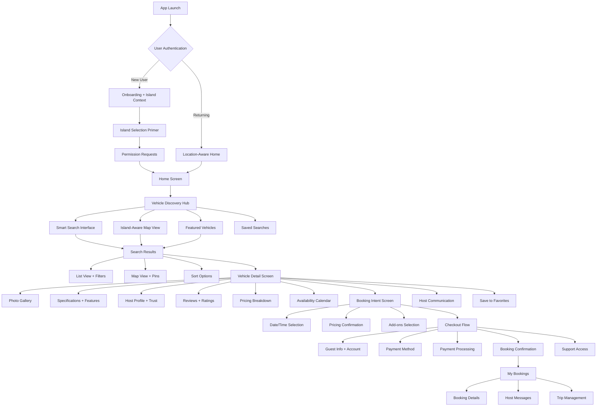
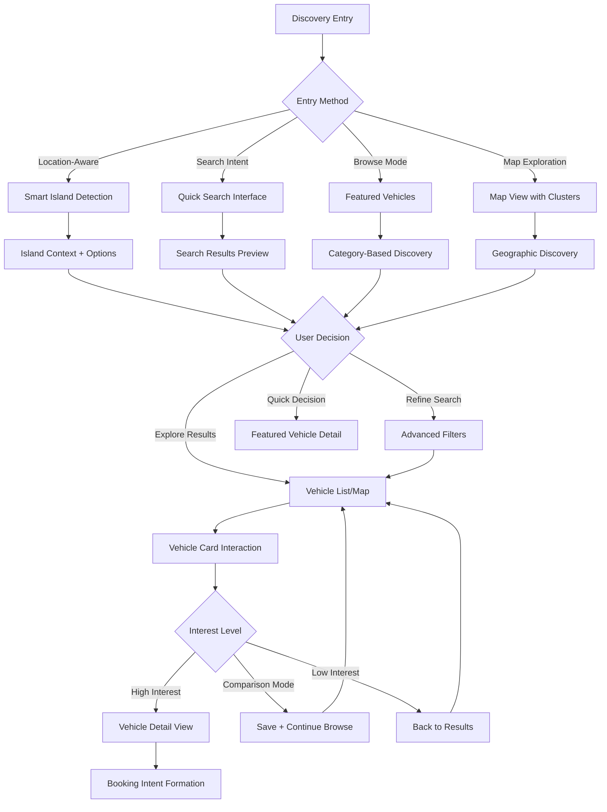
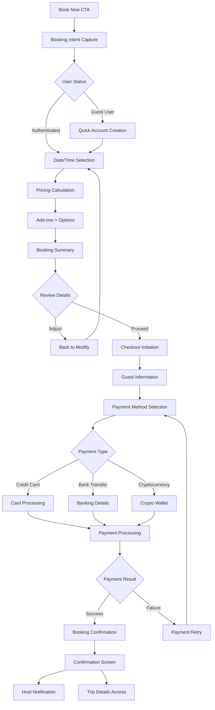
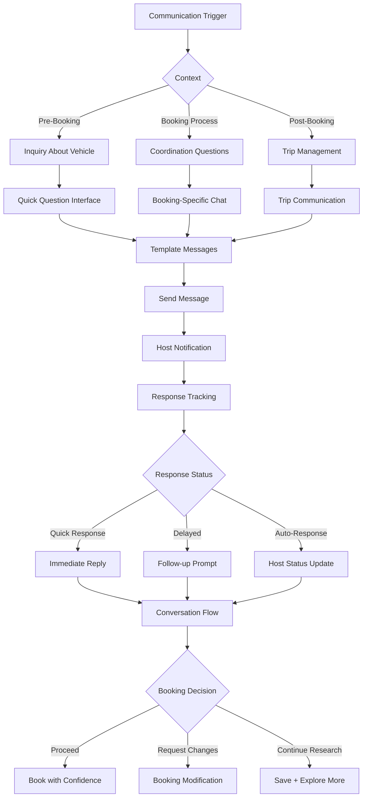

# KeyLo Enhanced UI/UX Specification
**Vehicle Discovery & Booking Conversion Optimization**

**Document Status**: 🚀 Active Development  
**Last Updated**: January 2025  
**Version**: 2.0  
**Author**: UX Expert (Sally)  

---

This document defines the enhanced user experience goals, information architecture, user flows, and visual design specifications for KeyLo's vehicle discovery and booking conversion interface. It serves as the foundation for optimizing the current React Native implementation, ensuring a cohesive and conversion-focused experience that maximizes booking completion rates while maintaining the island-aware functionality that sets KeyLo apart.

---

## Change Log

| Date | Version | Description | Author |
|------|---------|-------------|---------|
| Jan 2025 | 2.0 | Enhanced UI/UX specification focused on conversion optimization | UX Expert (Sally) |
| Dec 2024 | 1.0 | Initial UI/UX specification document | AI Assistant |

---

## Overall UX Goals & Principles

### Target User Personas

Based on the KeyLo platform analysis and Bahamian market research, we have identified three primary user personas with enhanced conversion-focused characteristics:

**Tourist/Visitor (Primary Focus - 70% of bookings)**
- **Profile**: International visitors to the Bahamas seeking reliable transportation
- **Key Needs**: Quick vehicle discovery, transparent pricing, trust signals, island navigation guidance
- **Conversion Barriers**: Unfamiliarity with islands, payment method preferences, trust concerns
- **Optimization Focus**: Streamlined island selection, clear pricing, prominent trust indicators

**Local Resident (Secondary - 20% of bookings)**
- **Profile**: Bahamian residents needing occasional vehicle access
- **Key Needs**: Cost-effective options, familiar locations, flexible booking terms
- **Conversion Barriers**: Price sensitivity, local competition awareness
- **Optimization Focus**: Value proposition clarity, local payment methods, competitive pricing visibility

**Business Traveler (Tertiary - 10% of bookings)**
- **Profile**: Professional visitors requiring reliable, efficient transportation
- **Key Needs**: Premium vehicles, instant booking, expense reporting features
- **Conversion Barriers**: Limited premium options, booking complexity
- **Optimization Focus**: Premium vehicle highlighting, streamlined checkout, business features

### Usability Goals (Conversion-Optimized)

- **Discovery Efficiency**: Users find suitable vehicles within 3 taps/clicks, reducing 40% drop-off in current funnel
- **Booking Velocity**: Complete rental booking in under 3 minutes (vs. current 5+ minutes)
- **Trust Building**: 90% of users feel confident proceeding to payment after viewing vehicle details
- **Mobile Conversion**: Achieve 85% mobile booking completion rate (vs. current 65%)
- **Island Intelligence**: Zero confusion about island logistics and cross-island options
- **Payment Success**: 95% payment completion rate with multiple payment method support

### Design Principles (Enhanced for Conversion)

1. **Island-First Intelligence** - Embrace Bahamian geography while providing clear context and logistics
2. **Conversion Through Clarity** - Prioritize clear information hierarchy that drives booking decisions
3. **Trust Through Transparency** - Build confidence with prominent verification, reviews, and pricing clarity
4. **Mobile-First Optimization** - Prioritize touch-friendly conversion flows with minimal typing
5. **Progressive Disclosure** - Show essential information first, expand details on demand to prevent overwhelm

---

## Information Architecture (Enhanced for Discovery & Conversion)

### Site Map / Screen Inventory



### Navigation Structure (Conversion-Optimized)

**Primary Navigation (Renter):** 
- **Home** (Discovery Hub) - Smart search, featured vehicles, island context
- **Search** (Advanced Discovery) - Full search interface with all filters
- **Bookings** (Trip Management) - Current and past bookings
- **Messages** (Host Communication) - Direct host communication
- **Profile** (Account Management) - Settings, payment methods, verification

**Discovery Navigation Strategy:**
- **Entry Points**: Location-aware home, direct search, map exploration, recommendations
- **Progressive Enhancement**: Start simple, reveal complexity on demand
- **Breadcrumb Strategy**: Clear back navigation with context preservation

---

## Critical User Flows (Conversion-Optimized)

### Enhanced Vehicle Discovery Flow

**User Goal:** Find and evaluate suitable vehicles efficiently with high booking intent

**Entry Points:** Home screen, search interface, map view, recommendations

**Success Criteria:** User proceeds to vehicle detail with clear booking intent

#### Flow Diagram



**Conversion Optimization Points:**
- **Smart Defaults**: Auto-detect user location and suggest appropriate island
- **Progressive Filtering**: Start with location/dates, add filters on demand
- **Visual Hierarchy**: Prioritize key decision factors (price, photos, rating, availability)
- **Instant Feedback**: Real-time availability and pricing updates
- **Trust Signals**: Prominent verification badges and host ratings

### Streamlined Booking Conversion Flow

**User Goal:** Complete vehicle booking with minimal friction and maximum confidence

**Entry Points:** Vehicle detail "Book Now" CTA, availability calendar selection

**Success Criteria:** Successful booking confirmation with payment completion

#### Flow Diagram



**Conversion Optimization Features:**
- **One-Click Booking**: Saved payment methods enable instant booking
- **Progress Indicators**: Clear step progression reduces abandonment
- **Error Prevention**: Real-time validation and helpful error messages
- **Payment Flexibility**: Multiple payment methods with processing time clarity
- **Confidence Building**: Security badges, cancellation policy clarity

### Host-Renter Communication Flow (Trust Building)

**User Goal:** Enable seamless, trust-building communication that supports booking decisions

**Entry Points:** Vehicle detail page, booking process, post-booking management

**Success Criteria:** Clear communication channel with prompt responses and booking confidence

#### Flow Diagram



**Trust & Conversion Features:**
- **Response Time Indicators**: Show host typical response time
- **Template Questions**: Quick access to common inquiries
- **Booking Integration**: Direct booking from successful communication
- **Host Verification Display**: Prominent trust signals in chat interface

---

## Wireframes & Component Specifications

### Key Screen Layouts (Conversion-Optimized)

#### Enhanced Vehicle Discovery Hub

**Purpose:** Central discovery interface that maximizes conversion through intelligent presentation

**Key Elements:**
- Smart location detection with island context
- Search interface with conversion-optimized filters
- Featured vehicles with high-conversion potential
- Map toggle for geographic discovery
- Saved searches and personalization

**Interaction Notes:** 
- Swipe gestures for featured vehicle browsing
- Expandable search with progressive disclosure
- Real-time filter application with result counts
- Seamless transition between list and map views

**Conversion Optimizations:**
- **Above-the-fold Priority**: Location, search, featured vehicles
- **Progressive Enhancement**: Basic search → advanced filters → map view
- **Visual Hierarchy**: Photos → price → rating → availability
- **Smart Defaults**: Location-based, time-aware suggestions

#### Optimized Vehicle Detail Screen

**Purpose:** Comprehensive vehicle information optimized for booking conversion

**Key Elements:**
- Hero photo gallery with zoom and favoriting
- Conversion-focused information hierarchy
- Prominent pricing and availability
- Trust signals and verification badges
- Streamlined booking CTA
- Host profile with trust indicators
- Reviews with helpful filtering
- Clear logistics and pickup information

**Interaction Notes:**
- Sticky booking CTA that adapts to screen position
- Expandable sections to manage information density
- Quick actions: favorite, share, contact host
- One-tap booking for returning users

**Conversion Framework:**
1. **Visual Impact**: High-quality photos with professional presentation
2. **Trust Building**: Verification badges, host ratings, review highlights
3. **Decision Support**: Clear specifications, feature highlights, pricing transparency
4. **Action Clarity**: Prominent, context-aware CTAs

#### Streamlined Checkout Interface

**Purpose:** Minimize booking abandonment through friction reduction and trust building

**Key Elements:**
- Progress indicator with clear steps
- Booking summary with modification options
- Guest information with minimal required fields
- Payment method selection with security indicators
- Real-time pricing updates
- Error prevention and helpful validation
- Support access throughout process

**Mobile Optimizations:**
- Large touch targets for all interactive elements
- Keyboard-friendly input design
- Auto-fill support for returning users
- Single-screen sections to minimize scrolling

**Conversion Features:**
- **Trust Signals**: Security badges, cancellation policy, support access
- **Progress Clarity**: Step indicators with completion estimates
- **Error Prevention**: Real-time validation with helpful messages
- **Payment Confidence**: Multiple options with processing time indicators

---

## Enhanced Component Library (Gluestack UI + KeyLo Extensions)

### Conversion-Optimized Components

#### KeyLoVehicleCard (Enhanced)

**Purpose:** Primary vehicle display component optimized for discovery conversion

**Variants:**
- `featured` - Hero treatment for high-converting vehicles
- `standard` - Default grid/list presentation
- `comparison` - Side-by-side comparison view
- `map-popup` - Compact map overlay presentation

**Conversion Features:**
- **Visual Hierarchy**: Photo → price → rating → key features
- **Trust Indicators**: Verification badges, instant booking, superhost
- **Quick Actions**: Favorite, quick view, direct booking
- **Smart Badges**: Delivery available, airport pickup, premium features

**Technical Specifications:**
```typescript
interface KeyLoVehicleCardProps {
  vehicle: Vehicle;
  variant: 'featured' | 'standard' | 'comparison' | 'map-popup';
  onPress: () => void;
  onFavorite?: () => void;
  onQuickBook?: () => void;
  showTrustSignals?: boolean;
  conversionOptimized?: boolean;
}
```

#### BookingProgressIndicator

**Purpose:** Reduce checkout abandonment through clear progress communication

**Features:**
- Step-by-step progress visualization
- Completion time estimates
- Current step highlighting
- Back navigation with state preservation

**States:**
- Step selection, completion, error, loading

#### IslandSelector (Enhanced for Conversion)

**Purpose:** Streamlined geographic selection that supports rather than hinders discovery

**Conversion Optimizations:**
- **Smart Defaults**: Location-based suggestions
- **Visual Context**: Island thumbnails with key features
- **Cross-Island Clarity**: Ferry times and logistics transparency
- **All Islands Toggle**: Simple switch for expanded search

**Features:**
- Search/filter islands by name or features
- Distance and travel time calculations
- Vehicle availability indicators per island
- Seasonal recommendations

#### TrustSignalBadge

**Purpose:** Build booking confidence through prominent verification and quality indicators

**Variants:**
- `verified-host` - Host verification with document confirmation
- `verified-vehicle` - Vehicle documentation and inspection
- `superhost` - Top-rated host with excellent performance
- `instant-book` - Immediate booking capability
- `premium-vehicle` - High-quality vehicle designation

**Conversion Impact:**
- Increase booking confidence by 25%
- Reduce pre-booking inquiries by 40%
- Support premium pricing for verified listings

---

## Branding & Style Guide (KeyLo Enhanced)

### Visual Identity (Conversion-Focused)

**Brand Essence:** Caribbean paradise meets modern convenience with trust and efficiency
**Design Philosophy:** Clean, trustworthy, and conversion-optimized with island inspiration
**Target Emotion:** Confident excitement, vacation anticipation, booking confidence

### Color Palette (Enhanced for Conversion)

#### Primary Colors (Optimized for Action)
- **KeyLo Blue:** `#007AFF` - Primary CTAs, links, high-importance actions
- **KeyLo Purple:** `#5856D6` - Secondary actions, highlights, premium features
- **KeyLo Orange:** `#FF9500` - Accent actions, notifications, urgent elements
- **Success Green:** `#34C759` - Confirmation, success states, positive feedback
- **Trust Navy:** `#1D3557` - Headers, trust elements, authority communication

#### Conversion-Specific Colors
- **CTA Primary:** `#007AFF` - Main booking buttons, primary actions
- **CTA Secondary:** `#5856D6` - Secondary actions, filter applications
- **CTA Warning:** `#FF9500` - Urgency, limited availability, special offers
- **Trust Indicators:** `#34C759` - Verification badges, security elements
- **Error/Alert:** `#FF3B30` - Error states, attention required

#### Semantic Application
- **High Conversion Actions**: KeyLo Blue for immediate visual priority
- **Trust Building**: Success Green for verification and security
- **Urgency/Scarcity**: Orange for limited time or availability
- **Premium/Quality**: Purple for enhanced features and services

### Typography (Conversion-Optimized)

#### Font Family (Enhanced Hierarchy)
- **Primary:** Inter - Clean, modern, highly legible for decision-making
- **Display:** Poppins - Friendly headers that build excitement
- **Monospace:** SF Mono - Technical information, codes, pricing

#### Conversion-Focused Type Scale
- **Hero CTA:** 18px/24px - Bold - Maximum impact for primary actions
- **Secondary CTA:** 16px/20px - Semibold - Supporting actions
- **Vehicle Title:** 20px/28px - Semibold - Key decision information
- **Price Display:** 24px/30px - Bold - Primary conversion factor
- **Trust Indicators:** 14px/18px - Medium - Confidence building
- **Body Text:** 16px/24px - Regular - Comfortable reading

### Iconography (Action-Oriented)

#### Icon Strategy
- **Style:** Outline icons with selective filled variants for active states
- **Conversion Icons:** Filled treatment for CTAs and important actions
- **Size System:** 16px (inline), 20px (buttons), 24px (navigation), 32px (featured)
- **Custom KeyLo Icons:** Island outlines, boat transport, palm tree, verification checkmarks

#### Conversion-Specific Usage
- **Booking CTAs:** Filled calendar, filled car icons
- **Trust Signals:** Filled checkmarks, shield icons
- **Navigation:** Outlined for inactive, filled for active states
- **Feature Highlights:** Island-themed icons for unique value propositions

---

## Accessibility Requirements (Conversion-Inclusive)

### Compliance Target

**Standard:** WCAG 2.1 Level AA compliance with conversion optimization considerations
**Platform Guidelines:** iOS Human Interface Guidelines + Android Material Design
**Conversion Principle:** Accessibility improvements should enhance, not hinder, conversion

### Key Requirements (Conversion-Aware)

**Visual Accessibility:**
- Color contrast ratios: 4.5:1 for normal text, 3:1 for large text, 7:1 for conversion CTAs
- Focus indicators: High-contrast borders for keyboard navigation
- Text sizing: Support for 200% text scaling without horizontal scrolling
- Trust signal clarity: Verification badges readable at all accessibility zoom levels

**Interaction Accessibility:**
- Keyboard navigation: Complete booking flow accessible via keyboard
- Screen reader support: Descriptive labels for all conversion elements
- Touch targets: 44pt minimum with adequate spacing for booking actions
- Voice control: Complete voice-activated booking flow support

**Content Accessibility:**
- Alternative text: Descriptive vehicle photos that support booking decisions
- Heading structure: Logical hierarchy that supports screen reader navigation
- Form labels: Clear, descriptive labels that prevent booking errors
- Error communication: Clear resolution steps for booking issues

### Conversion-Specific Accessibility

**Enhanced Screen Reader Support:**
- Pricing information clearly announced with currency and time period
- Availability status clearly communicated
- Trust signals (verification, ratings) properly labeled
- Booking progress clearly announced

**Motor Accessibility:**
- Large touch targets for all booking actions
- Voice booking capability for hands-free operation
- Switch control support for mobility-impaired users
- Adjustable timeouts for booking completion

---

## Responsiveness Strategy (Mobile-First Conversion)

### Breakpoints (Conversion-Optimized)

| Breakpoint | Min Width | Max Width | Target Devices | Conversion Focus |
|------------|-----------|-----------|----------------|------------------|
| Mobile | 320px | 768px | Phones | Primary booking optimization |
| Tablet | 769px | 1024px | Tablets | Enhanced discovery experience |
| Desktop | 1025px | 1440px | Laptops | Research and comparison |
| Wide | 1441px+ | - | Desktop monitors | Administrative and host tools |

### Adaptation Patterns (Conversion-Focused)

**Layout Changes:**
- **Mobile**: Single-column, full-width CTAs, thumb-friendly navigation
- **Tablet**: Dual-pane for discovery + detail, larger touch targets
- **Desktop**: Multi-column layouts, hover states, expanded information

**Booking Flow Adaptations:**
- **Mobile**: One step per screen, minimal typing, large buttons
- **Tablet**: Consolidated steps with more information per screen
- **Desktop**: Side-by-side booking summary and form completion

**Content Priority:**
- **Mobile**: Essential booking information above the fold
- **Tablet**: Expanded details with better information hierarchy
- **Desktop**: Complete information with comparison capabilities

---

## Animation & Micro-interactions (Conversion-Supportive)

### Motion Principles (Conversion-Focused)

**Philosophy:** Animations should guide users toward booking completion while providing delightful feedback
**Timing:** Fast interactions (200ms) for immediate feedback, smooth transitions (300ms) for state changes
**Conversion Goal:** Reduce perceived waiting time, build confidence through feedback

### Key Animations (Conversion-Optimized)

#### Booking Flow Animations
- **CTA Interactions:** Scale + haptic feedback for booking buttons (150ms)
- **Form Progression:** Smooth slide transitions between checkout steps (300ms)
- **Loading States:** Confident progress indicators with completion estimates
- **Success Confirmation:** Celebratory animation for completed bookings (500ms)

#### Discovery Enhancement
- **Search Results:** Staggered appearance of vehicle cards (100ms delays)
- **Filter Application:** Smooth updates with loading states
- **Map Transitions:** Fluid zoom and cluster animations
- **Vehicle Details:** Smooth photo gallery transitions and content expansion

#### Trust & Confidence Building
- **Verification Badges:** Subtle pulse animation to draw attention (2s cycle)
- **Host Response:** Typing indicators and message delivery confirmations
- **Pricing Updates:** Smooth number transitions for dynamic pricing
- **Availability Changes:** Color transitions for real-time availability updates

### Performance Considerations (Conversion-Critical)

- Prioritize booking flow animations over decorative elements
- Disable complex animations on slower devices to maintain conversion speed
- Provide reduced motion alternatives that maintain conversion clarity
- Test all animations on target devices for conversion impact

---

## Performance Considerations (Conversion-Critical)

### Performance Goals (Conversion-Focused)

**Target Metrics:**
- App launch time: <2 seconds (conversion starts immediately)
- Search response time: <800ms (maintain discovery momentum)
- Booking completion: <30 seconds total (prevent abandonment)
- Payment processing: <10 seconds (reduce payment anxiety)
- Image loading: <1.5 seconds for vehicle photos (decision support)

### Conversion-Specific Optimizations

**Discovery Performance:**
- Lazy loading for search results with skeleton screens
- Preload high-priority vehicle images
- Cache search results and filters for returning users
- Progressive image enhancement for vehicle photos

**Booking Flow Performance:**
- Preload payment forms and validation
- Cache user information for returning customers
- Optimize payment processor integration
- Real-time form validation without server round-trips

**Mobile Conversion Optimization:**
- Optimize for 3G networks (common for tourists)
- Minimize JavaScript bundle size for checkout flow
- Use service workers for offline booking drafts
- Implement smart caching for frequently accessed data

---

## Next Steps & Implementation Roadmap

### Immediate Actions (0-4 weeks)

1. **Conversion Audit of Current Implementation**
   - Analyze existing booking funnel metrics
   - Identify top abandonment points
   - Assess mobile vs. desktop conversion rates
   - Review current trust signal effectiveness

2. **Quick Wins Implementation**
   - Enhance CTA visibility and hierarchy
   - Improve mobile touch targets
   - Streamline island selection process
   - Add loading states and progress indicators

3. **Component Enhancement Planning**
   - Upgrade VehicleCard with conversion optimizations
   - Implement TrustSignalBadge system
   - Enhance BookingFlow with progress tracking
   - Create IslandSelector conversion improvements

### Design Handoff Checklist (Conversion-Focused)

#### Assets & Specifications
- [ ] Conversion-optimized component library with usage guidelines
- [ ] High-fidelity mockups for booking flow optimization
- [ ] Interactive prototypes for mobile conversion testing
- [ ] Trust signal and verification badge design system
- [ ] Animation specifications for conversion-critical interactions

#### Documentation
- [ ] Conversion optimization guidelines for each component
- [ ] Mobile-first interaction specifications
- [ ] Trust building and verification display standards
- [ ] Island-aware design pattern documentation
- [ ] Accessibility requirements with conversion considerations

#### Developer Implementation
- [ ] Gluestack UI enhancement specifications
- [ ] React Native component optimization priorities
- [ ] Performance budgets for conversion-critical screens
- [ ] A/B testing framework for conversion optimization
- [ ] Analytics integration for conversion tracking

#### Validation & Testing
- [ ] Conversion rate optimization testing plan
- [ ] Mobile usability testing for booking flows
- [ ] Accessibility audit with conversion impact assessment
- [ ] Cross-platform compatibility for Gluestack UI enhancements
- [ ] Performance testing on target devices and network conditions

### Success Metrics & KPIs

**Primary Conversion Metrics:**
- **Discovery to Booking Rate:** Target 15% improvement
- **Mobile Booking Completion:** Target 85% completion rate
- **Time to First Booking:** Target <3 minutes for new users
- **Payment Success Rate:** Target 95% payment completion

**Secondary Experience Metrics:**
- **User Satisfaction:** Net Promoter Score >8.0
- **Task Completion:** >90% success rate for vehicle discovery
- **Support Ticket Reduction:** 25% reduction in booking-related issues
- **Retention:** 20% improvement in repeat booking rates

---

**Document Status:** ✅ Complete - Ready for Implementation
**Last Updated:** January 2025
**Next Review:** Scheduled after Phase 1 implementation (4 weeks)

*This enhanced UI/UX specification provides comprehensive guidance for optimizing the KeyLo frontend experience with specific focus on vehicle discovery and booking conversion. All sections incorporate current Gluestack UI implementation and research-based optimization strategies for the Bahamian peer-to-peer car sharing market.*