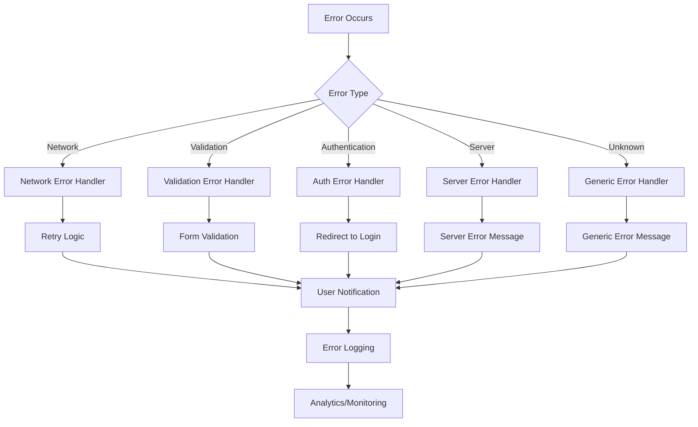

# Error Handling Guidelines

## Overview

KeyLo implements comprehensive error handling patterns following BMAD standards to ensure consistent, user-friendly error management across the entire application. This document outlines the error handling architecture, patterns, and best practices for both frontend and backend development.

## Architecture Overview

### Error Handling Philosophy

1. **Fail Fast**: Detect errors early and handle them gracefully
2. **User-Friendly**: Provide clear, actionable error messages to users
3. **Developer-Friendly**: Include detailed error information for debugging
4. **Consistent**: Use standardized error patterns across the application
5. **Recoverable**: Implement retry logic and fallback mechanisms where appropriate

### Error Flow Architecture



## Frontend Error Handling

### Error Types and Classification

The frontend uses a comprehensive error type system:

```typescript
export enum ErrorType {
  NETWORK = 'NETWORK',           // Connection issues
  AUTHENTICATION = 'AUTHENTICATION', // Auth failures
  AUTHORIZATION = 'AUTHORIZATION',   // Permission issues
  VALIDATION = 'VALIDATION',         // Input validation
  NOT_FOUND = 'NOT_FOUND',          // Resource not found
  SERVER = 'SERVER',                // Server errors
  UNKNOWN = 'UNKNOWN'               // Unexpected errors
}

export interface AppError {
  type: ErrorType;
  message: string;
  code?: string;
  statusCode?: number;
  details?: any;
  timestamp: string;
  context?: string;
}
```

### Error Creation and Parsing

#### Creating Errors
```typescript
import { createError, ErrorType } from '@/utils/errorHandler';

// Create a validation error
const validationError = createError(
  ErrorType.VALIDATION,
  'Email is required',
  {
    code: 'VALIDATION_ERROR',
    details: { field: 'email' },
    context: 'LoginForm'
  }
);

// Create a network error
const networkError = createError(
  ErrorType.NETWORK,
  'Unable to connect to server',
  {
    context: 'API_CALL',
    details: { endpoint: '/api/users' }
  }
);
```

#### Parsing API Errors
```typescript
import { parseApiError } from '@/utils/errorHandler';

try {
  const response = await fetch('/api/users');
  const data = await response.json();
} catch (error) {
  const appError = parseApiError(error, 'UserService');
  handleError(appError);
}
```

### Error Handling Patterns

#### 1. Component-Level Error Handling
```typescript
import React, { useState } from 'react';
import { handleError, showErrorAlert } from '@/utils/errorHandler';

const UserProfile: React.FC = () => {
  const [loading, setLoading] = useState(false);
  const [error, setError] = useState<AppError | null>(null);

  const loadUserData = async () => {
    try {
      setLoading(true);
      setError(null);
      const userData = await userService.getCurrentUser();
      // Handle success
    } catch (error) {
      const appError = handleError(error, 'UserProfile.loadUserData', {
        showAlert: true,
        alertTitle: 'Failed to Load Profile'
      });
      setError(appError);
    } finally {
      setLoading(false);
    }
  };

  if (error) {
    return <ErrorDisplay error={error} onRetry={loadUserData} />;
  }

  // Render component
};
```

#### 2. Service-Level Error Handling
```typescript
import { safeAsync, withRetry } from '@/utils/errorHandler';

class UserService {
  // Safe async wrapper
  getCurrentUser = safeAsync(
    async () => {
      const response = await fetch('/api/user/me');
      return response.json();
    },
    'UserService.getCurrentUser',
    {
      showAlert: true,
      defaultValue: null
    }
  );

  // With retry logic
  async updateUser(userData: Partial<User>) {
    return withRetry(
      async () => {
        const response = await fetch('/api/user', {
          method: 'PUT',
          body: JSON.stringify(userData)
        });
        return response.json();
      },
      {
        maxRetries: 3,
        delay: 1000,
        context: 'UserService.updateUser'
      }
    );
  }
}
```

#### 3. Global Error Boundary
```typescript
import React from 'react';
import { ErrorBoundary } from '@/components/ErrorBoundary';

const App: React.FC = () => {
  return (
    <ErrorBoundary
      onError={(error, errorInfo) => {
        // Log to analytics service
        analytics.logError('ErrorBoundary', error, errorInfo);
      }}
    >
      <AppContent />
    </ErrorBoundary>
  );
};
```

### User-Friendly Error Messages

The system provides context-aware, user-friendly error messages:

```typescript
export function getUserFriendlyMessage(error: AppError): string {
  switch (error.type) {
    case ErrorType.NETWORK:
      return 'Please check your internet connection and try again.';
    
    case ErrorType.AUTHENTICATION:
      return 'Please log in to continue.';
    
    case ErrorType.AUTHORIZATION:
      return 'You don\'t have permission to perform this action.';
    
    case ErrorType.VALIDATION:
      return error.message || 'Please check your input and try again.';
    
    case ErrorType.NOT_FOUND:
      return 'The requested item could not be found.';
    
    case ErrorType.SERVER:
      return 'Server is temporarily unavailable. Please try again later.';
    
    default:
      return 'Something went wrong. Please try again.';
  }
}
```

## Backend Error Handling

### Error Classes

The backend uses a hierarchy of error classes for consistent error handling:

```typescript
class ApiError extends Error {
  constructor(message, statusCode = 500, code = 'INTERNAL_ERROR', details = {}) {
    super(message);
    this.name = 'ApiError';
    this.statusCode = statusCode;
    this.code = code;
    this.details = details;
    this.isOperational = true;
  }
}

class ValidationError extends ApiError {
  constructor(message, details = {}) {
    super(message, 400, 'VALIDATION_ERROR', details);
    this.name = 'ValidationError';
  }
}

class AuthenticationError extends ApiError {
  constructor(message = 'Authentication required') {
    super(message, 401, 'AUTHENTICATION_ERROR');
    this.name = 'AuthenticationError';
  }
}
```

### Global Error Middleware

```javascript
const { logError } = require('../config/logger');

function handleError(error, req, res, next) {
  let statusCode = 500;
  let errorResponse;

  // Handle known error types
  if (error instanceof ApiError) {
    statusCode = error.statusCode;
    errorResponse = formatErrorResponse(error, req);
  } else if (error.name === 'ValidationError') {
    statusCode = 400;
    errorResponse = formatErrorResponse(
      new ValidationError(error.message, error.details),
      req
    );
  } else {
    // Unknown error
    errorResponse = formatErrorResponse(
      new ApiError('Internal server error'),
      req
    );
  }

  // Log error with context
  logError('API Error', error, {
    statusCode,
    path: req.path,
    method: req.method,
    userId: req.user?.userId,
    ip: req.ip
  });

  res.status(statusCode).json(errorResponse);
}
```

### Async Error Wrapper

```javascript
function asyncHandler(fn) {
  return (req, res, next) => {
    Promise.resolve(fn(req, res, next)).catch(next);
  };
}

// Usage
router.get('/users/:id', asyncHandler(async (req, res) => {
  const user = await userService.findById(req.params.id);
  if (!user) {
    throw new NotFoundError('User');
  }
  res.json({ user });
}));
```

## Error Logging and Monitoring

### Structured Logging

Both frontend and backend implement structured logging:

#### Frontend Logging
```typescript
import { logError } from '@/services/loggingService';

// Log error with context
logError('UserService', 'Failed to load user data', {
  userId: user.id,
  endpoint: '/api/user/me',
  error: error.message
});
```

#### Backend Logging
```javascript
const { logError, logAuditEvent } = require('../config/logger');

// Log application error
logError('UserController', error, {
  userId: req.user?.userId,
  action: 'getUserProfile',
  ip: req.ip
});

// Log security event
logAuditEvent('LOGIN_FAILED', null, {
  email: req.body.email,
  reason: 'Invalid credentials',
  ip: req.ip
});
```

### Error Analytics

Implement error tracking for production monitoring:

```typescript
class ErrorAnalytics {
  static logError(error: AppError, context: string) {
    // Send to analytics service
    analytics.track('Error Occurred', {
      errorType: error.type,
      errorCode: error.code,
      context,
      timestamp: error.timestamp,
      userId: getCurrentUserId()
    });
  }

  static logErrorResolution(error: AppError, resolution: string) {
    analytics.track('Error Resolved', {
      errorType: error.type,
      resolution,
      timestamp: new Date().toISOString()
    });
  }
}
```

## Best Practices

### Development Guidelines

1. **Always Handle Errors**: Never ignore or suppress errors
2. **Use Appropriate Error Types**: Choose the most specific error type
3. **Provide Context**: Include relevant context information
4. **Log Appropriately**: Log errors with sufficient detail for debugging
5. **User Experience**: Show user-friendly messages, not technical details
6. **Retry Logic**: Implement retry for transient failures
7. **Fallback Mechanisms**: Provide fallback options when possible

### Code Examples

#### ✅ Good Error Handling
```typescript
const saveUserProfile = async (userData: UserData) => {
  try {
    const result = await userService.updateProfile(userData);
    showSuccessMessage('Profile updated successfully');
    return result;
  } catch (error) {
    const appError = handleError(error, 'ProfileScreen.saveUserProfile', {
      showAlert: true,
      alertTitle: 'Failed to Save Profile',
      showRetry: true,
      onRetry: () => saveUserProfile(userData)
    });
    throw appError;
  }
};
```

#### ❌ Poor Error Handling
```typescript
const saveUserProfile = async (userData: UserData) => {
  try {
    return await userService.updateProfile(userData);
  } catch (error) {
    console.log('Error:', error); // Poor logging
    alert('Error occurred'); // Poor user experience
    return null; // Swallowing error
  }
};
```

### Testing Error Scenarios

```typescript
describe('UserService Error Handling', () => {
  it('should handle network errors gracefully', async () => {
    // Mock network failure
    jest.spyOn(fetch, 'fetch').mockRejectedValue(new Error('Network error'));
    
    const result = await userService.getCurrentUser();
    
    expect(result).toBeNull(); // Should return default value
    expect(logError).toHaveBeenCalledWith(
      expect.stringContaining('UserService'),
      expect.any(Error)
    );
  });

  it('should retry on transient failures', async () => {
    let callCount = 0;
    jest.spyOn(fetch, 'fetch').mockImplementation(() => {
      callCount++;
      if (callCount < 3) {
        throw new Error('Temporary failure');
      }
      return Promise.resolve({ ok: true, json: () => ({ user: mockUser }) });
    });

    const result = await userService.getCurrentUserWithRetry();
    
    expect(callCount).toBe(3);
    expect(result).toEqual(mockUser);
  });
});
```

## Error Recovery Strategies

### Automatic Recovery
- **Retry Logic**: Automatic retry for network and server errors
- **Fallback Data**: Use cached data when fresh data is unavailable
- **Graceful Degradation**: Disable features rather than breaking the app

### User-Initiated Recovery
- **Retry Buttons**: Allow users to retry failed operations
- **Refresh Options**: Provide manual refresh capabilities
- **Alternative Actions**: Offer alternative ways to complete tasks

### System Recovery
- **Circuit Breakers**: Prevent cascading failures
- **Health Checks**: Monitor system health and recover automatically
- **Rollback Mechanisms**: Revert to previous working state when needed

This comprehensive error handling system ensures that KeyLo provides a robust, user-friendly experience while maintaining excellent developer productivity and system reliability.
