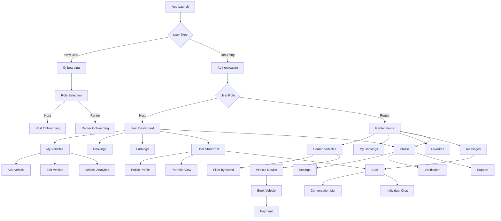
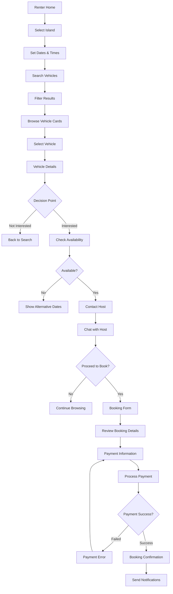
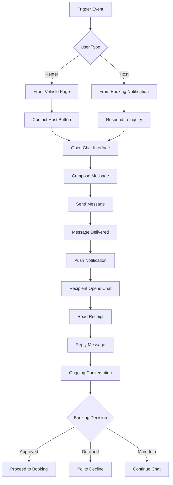

# KeyLo UI/UX Specification

**Document Status**: 🚧 In Progress  
**Last Updated**: December 2024  
**Version**: 1.0  
**Author**: AI Assistant  

---

This document defines the user experience goals, information architecture, user flows, and visual design specifications for KeyLo' user interface. It serves as the foundation for visual design and frontend development, ensuring a cohesive and user-centered experience.

---

## Change Log

| Date | Version | Description | Author |
|------|---------|-------------|---------|
| Dec 2024 | 1.0 | Initial UI/UX specification document | AI Assistant |

---

## Overall UX Goals & Principles

### Target User Personas

Based on the KeyLo project documentation, we have identified three primary user personas:

**Host (Vehicle Owner):** Local Bahamians who own vehicles and want to generate income by renting them out. They need efficient tools to manage their fleet, set availability, track earnings, and communicate with renters. They value simplicity, reliability, and clear financial insights.

**Renter (Tourist/Visitor):** Tourists and visitors to the Bahamas who need reliable transportation for their stay. They prioritize easy discovery, transparent pricing, secure booking, and seamless communication with hosts. They value trust indicators and island-specific guidance.

**Administrator:** Platform managers who oversee the marketplace, handle disputes, manage user verification, and ensure platform quality. They need comprehensive oversight tools, analytics, and efficient workflow management.

### Usability Goals

- **Ease of onboarding**: New hosts can list their first vehicle within 10 minutes
- **Discovery efficiency**: Renters can find suitable vehicles on their target island within 3 clicks
- **Booking simplicity**: Complete rental booking process in under 5 minutes
- **Trust building**: Clear verification badges, reviews, and host profiles build confidence
- **Island intelligence**: Location-aware features help users navigate Bahamas geography
- **Communication clarity**: Real-time chat with translation support for international visitors

### Design Principles

1. **Island-First Design** - Embrace the tropical, relaxed atmosphere of the Bahamas while maintaining professionalism
2. **Geographic Intelligence** - Always consider the user's island context and provide location-aware experiences
3. **Trust Through Transparency** - Make verification, pricing, and policies crystal clear
4. **Mobile-First Simplicity** - Prioritize mobile experience with touch-friendly interactions
5. **Cultural Sensitivity** - Respect local customs and provide inclusive experiences for international visitors

---

## Information Architecture (IA)

### Site Map / Screen Inventory



### Navigation Structure

**Primary Navigation (Host):** Bottom tab navigation with Dashboard, Vehicles, Bookings, Storefront, and Profile

**Primary Navigation (Renter):** Bottom tab navigation with Home, Search, Bookings, Messages, and Profile

**Secondary Navigation:** Context-specific navigation within each primary section, using stack navigation for drill-down experiences

**Breadcrumb Strategy:** Minimal breadcrumbs due to mobile-first design; rely on clear header titles and back navigation

---

## User Flows

### Host Vehicle Listing Flow

**User Goal:** Host wants to list a new vehicle for rental to start earning income

**Entry Points:** Host Dashboard "Add Vehicle" button, empty state in My Vehicles

**Success Criteria:** Vehicle is successfully listed and visible to renters with all required information

#### Flow Diagram

```mermaid
graph TD
    A[Host Dashboard] --> B[Click "Add Vehicle"]
    B --> C[Vehicle Information Form]
    C --> D{Form Validation}
    D -->|Invalid| E[Show Errors]
    E --> C
    D -->|Valid| F[Upload Photos]
    F --> G[Set Pricing & Availability]
    G --> H[Location & Pickup Details]
    H --> I[Review Listing]
    I --> J{Confirm Listing}
    J -->|Cancel| K[Save as Draft]
    J -->|Confirm| L[Submit for Review]
    L --> M[Verification Process]
    M --> N{Approval Status}
    N -->|Approved| O[Vehicle Live]
    N -->|Rejected| P[Feedback & Resubmit]
    O --> Q[Success Confirmation]
```

#### Edge Cases & Error Handling:
- Photo upload failures with retry mechanism
- Incomplete form submission with field-specific error messages
- Network connectivity issues during submission
- Vehicle verification rejection with clear feedback
- Duplicate vehicle detection and prevention

**Notes:** Include progress indicator throughout the flow. Allow saving drafts at any stage. Provide helpful tips and examples for each form section.

### Renter Vehicle Discovery & Booking Flow

**User Goal:** Renter wants to find and book a suitable vehicle for their stay on a specific island

**Entry Points:** App home screen, search from navigation, direct link from host storefront

**Success Criteria:** Successfully complete booking with confirmed reservation and payment

#### Flow Diagram



#### Edge Cases & Error Handling:
- No vehicles available for selected criteria
- Vehicle becomes unavailable during booking process
- Payment processing failures
- Host doesn't respond to booking request
- Last-minute cancellations

**Notes:** Implement smart defaults based on user location. Show real-time availability. Provide clear pricing breakdown including all fees.

### Host-Renter Communication Flow

**User Goal:** Enable seamless communication between hosts and renters for booking coordination

**Entry Points:** Vehicle detail page, booking confirmation, dashboard notifications

**Success Criteria:** Clear communication channel established with message delivery confirmation

#### Flow Diagram



#### Edge Cases & Error Handling:
- Offline message delivery
- Inappropriate content filtering
- Language translation needs
- Unresponsive users
- Spam prevention

**Notes:** Include quick reply templates. Support photo sharing for vehicle condition updates. Implement read receipts and typing indicators.

---

## Wireframes & Mockups

**Primary Design Files:** To be created in Figma - [Design System Link TBD]

### Key Screen Layouts

#### Host Dashboard

**Purpose:** Central hub for hosts to manage their vehicle rental business

**Key Elements:**
- Quick stats cards (earnings, bookings, vehicle performance)
- Recent activity feed
- Quick action buttons (add vehicle, view messages)
- Upcoming bookings preview
- Performance insights chart

**Interaction Notes:** Swipeable stats cards, pull-to-refresh for activity feed, floating action button for quick vehicle addition

**Design File Reference:** [Figma Frame - Host Dashboard]

#### Vehicle Search Results

**Purpose:** Help renters discover available vehicles with efficient filtering and comparison

**Key Elements:**
- Island selector with visual map
- Date/time picker with calendar view
- Filter chips (price, type, features)
- Vehicle cards with key info and photos
- Map view toggle
- Sort options

**Interaction Notes:** Horizontal scrolling for filters, card-based layout with favorite heart icon, smooth transitions between list and map views

**Design File Reference:** [Figma Frame - Search Results]

#### Vehicle Detail Page

**Purpose:** Comprehensive vehicle information to help renters make booking decisions

**Key Elements:**
- Photo gallery with zoom capability
- Vehicle specifications and features
- Host profile summary with ratings
- Pricing breakdown
- Availability calendar
- Reviews and ratings section
- Contact host button
- Book now CTA

**Interaction Notes:** Swipeable photo gallery, expandable sections for details, sticky booking CTA, smooth scroll to sections

**Design File Reference:** [Figma Frame - Vehicle Details]

#### Chat Interface

**Purpose:** Facilitate clear communication between hosts and renters

**Key Elements:**
- Message bubbles with timestamps
- User avatars and verification badges
- Photo sharing capability
- Quick reply suggestions
- Booking context card
- Translation toggle for international users

**Interaction Notes:** Auto-scroll to latest message, haptic feedback for sent messages, swipe gestures for quick actions

**Design File Reference:** [Figma Frame - Chat Interface]

---

## Component Library / Design System

### Design System Approach

**Framework:** Frosted Glass Design System (custom implementation)
**Base Library:** React Native Elements + Custom Components
**Theming:** Supports light/dark modes with island-inspired color palettes
**Consistency:** Shared component library across all screens with standardized props and behaviors

### Core Components

#### IslandButton

**Purpose:** Primary action button with island-themed styling

**Variants:**
- `primary` - Main call-to-action (ocean blue gradient)
- `secondary` - Secondary actions (coral accent)
- `outline` - Subtle actions (transparent with border)
- `ghost` - Minimal actions (text only)

**States:**
- Default
- Pressed
- Disabled
- Loading (with spinner)

**Props:**
```typescript
interface IslandButtonProps {
  variant: 'primary' | 'secondary' | 'outline' | 'ghost';
  size: 'small' | 'medium' | 'large';
  disabled?: boolean;
  loading?: boolean;
  onPress: () => void;
  children: React.ReactNode;
  icon?: string;
  fullWidth?: boolean;
}
```

#### VehicleCard

**Purpose:** Display vehicle information in search results and listings

**Variants:**
- `grid` - Compact card for grid layouts
- `list` - Extended card for list layouts
- `featured` - Highlighted card for promoted listings

**States:**
- Default
- Favorited
- Unavailable
- Loading

**Key Features:**
- Image carousel with dots indicator
- Favorite heart icon with animation
- Rating stars with numeric display
- Price per day with currency formatting
- Quick action buttons (view, contact)

#### IslandSelector

**Purpose:** Geographic selection component for island-based filtering

**Variants:**
- `dropdown` - Compact selector for forms
- `map` - Interactive map with island highlights
- `grid` - Visual grid with island thumbnails

**States:**
- Default
- Selected
- Loading islands
- Error state

**Features:**
- Search/filter islands by name
- Visual indicators for vehicle availability
- Distance calculations from user location

#### ChatBubble

**Purpose:** Message display in chat interface

**Variants:**
- `sent` - User's outgoing messages
- `received` - Incoming messages
- `system` - System notifications

**States:**
- Sending
- Delivered
- Read
- Failed

**Features:**
- Timestamp display
- Read receipts
- Photo/media support
- Link previews

#### DateTimePicker

**Purpose:** Date and time selection for bookings

**Variants:**
- `date` - Date only selection
- `time` - Time only selection
- `datetime` - Combined date and time
- `range` - Date range selection

**Features:**
- Island timezone awareness
- Availability highlighting
- Minimum/maximum date constraints
- Quick preset options (today, tomorrow, weekend)

#### StatusBadge

**Purpose:** Display status information with consistent styling

**Variants:**
- `success` - Confirmed, approved, active
- `warning` - Pending, review required
- `error` - Rejected, failed, inactive
- `info` - Neutral information

**States:**
- Static
- Pulsing (for pending states)

#### FilterChip

**Purpose:** Selectable filter options in search interface

**Variants:**
- `default` - Standard filter option
- `price` - Price range with slider
- `rating` - Star rating filter

**States:**
- Unselected
- Selected
- Disabled

**Features:**
- Clear individual filters
- Badge with count when applicable
- Smooth selection animations

---

## Branding & Style Guide

### Visual Identity

**Brand Essence:** Tropical paradise meets modern convenience
**Design Philosophy:** Clean, approachable, and trustworthy with island-inspired elements
**Target Emotion:** Relaxed confidence, vacation excitement, local authenticity

### Color Palette

#### Primary Colors
- **Ocean Blue:** `#0077BE` - Primary actions, links, active states
- **Coral Accent:** `#FF6B6B` - Secondary actions, highlights, notifications
- **Sand Beige:** `#F5E6D3` - Background, cards, subtle elements
- **Palm Green:** `#4ECDC4` - Success states, confirmations, positive feedback

#### Neutral Colors
- **Charcoal:** `#2C3E50` - Primary text, headers
- **Slate Gray:** `#7F8C8D` - Secondary text, captions
- **Light Gray:** `#ECF0F1` - Borders, dividers, disabled states
- **Pure White:** `#FFFFFF` - Backgrounds, cards, contrast elements

#### Semantic Colors
- **Success:** `#27AE60` - Confirmations, completed actions
- **Warning:** `#F39C12` - Alerts, pending states
- **Error:** `#E74C3C` - Errors, destructive actions
- **Info:** `#3498DB` - Information, neutral notifications

#### Dark Mode Palette
- **Dark Background:** `#1A1A1A`
- **Dark Surface:** `#2D2D2D`
- **Dark Text:** `#E0E0E0`
- **Dark Secondary:** `#A0A0A0`

### Typography

#### Font Family
- **Primary:** Inter (system fallback: San Francisco, Roboto)
- **Display:** Poppins (for headers and emphasis)
- **Monospace:** SF Mono (for codes, technical content)

#### Type Scale
- **Display Large:** 32px / 40px line height - Hero headlines
- **Display Medium:** 28px / 36px line height - Page titles
- **Headline:** 24px / 32px line height - Section headers
- **Title:** 20px / 28px line height - Card titles, important labels
- **Body Large:** 16px / 24px line height - Primary body text
- **Body Medium:** 14px / 20px line height - Secondary text
- **Caption:** 12px / 16px line height - Metadata, timestamps
- **Label:** 11px / 16px line height - Form labels, tags

#### Font Weights
- **Regular:** 400 - Body text, descriptions
- **Medium:** 500 - Emphasized text, button labels
- **Semibold:** 600 - Subheadings, important information
- **Bold:** 700 - Headlines, strong emphasis

### Iconography

#### Icon Style
- **Style:** Outline icons with 2px stroke weight
- **Size System:** 16px, 20px, 24px, 32px, 48px
- **Library:** Feather Icons + custom island-themed icons
- **Custom Icons:** Palm tree, island outline, boat, scooter, car variants

#### Icon Usage
- Navigation: 24px icons with labels
- Buttons: 16px-20px icons depending on button size
- Status indicators: 16px icons with color coding
- Feature highlights: 32px-48px icons for empty states and onboarding

### Spacing & Layout

#### Spacing Scale (8px base unit)
- **xs:** 4px - Tight spacing, icon gaps
- **sm:** 8px - Small gaps, form field spacing
- **md:** 16px - Standard spacing, card padding
- **lg:** 24px - Section spacing, large gaps
- **xl:** 32px - Page margins, major sections
- **2xl:** 48px - Hero sections, major separations

#### Layout Grid
- **Mobile:** 16px margins, 8px gutters
- **Tablet:** 24px margins, 16px gutters
- **Desktop:** 32px margins, 24px gutters

#### Border Radius
- **Small:** 4px - Buttons, chips, small cards
- **Medium:** 8px - Cards, modals, form inputs
- **Large:** 16px - Large cards, image containers
- **Round:** 50% - Avatars, circular buttons

---

## Accessibility Requirements

### Compliance Target

**Standard:** WCAG 2.1 Level AA compliance
**Platform Guidelines:** iOS Human Interface Guidelines + Android Material Design Accessibility
**Testing Tools:** React Native Accessibility Inspector, screen reader testing

### Key Requirements

#### Screen Reader Support
- All interactive elements have descriptive accessibility labels
- Proper heading hierarchy for navigation
- Alternative text for all images and icons
- Announcement of state changes (loading, errors, success)

#### Motor Accessibility
- Minimum touch target size: 44x44 points (iOS) / 48x48 dp (Android)
- Support for external keyboards and switch controls
- Gesture alternatives for complex interactions
- Adjustable timeout periods for time-sensitive actions

#### Visual Accessibility
- Color contrast ratio minimum 4.5:1 for normal text, 3:1 for large text
- Information not conveyed by color alone
- Support for system font size preferences
- High contrast mode compatibility
- Focus indicators for keyboard navigation

#### Cognitive Accessibility
- Clear, simple language throughout the interface
- Consistent navigation patterns
- Error messages with clear resolution steps
- Progress indicators for multi-step processes
- Confirmation dialogs for destructive actions

### Testing Strategy

1. **Automated Testing:** ESLint accessibility rules, automated contrast checking
2. **Manual Testing:** Screen reader testing (VoiceOver, TalkBack), keyboard navigation
3. **User Testing:** Include users with disabilities in usability testing sessions
4. **Continuous Monitoring:** Regular accessibility audits during development

---

## Responsiveness Strategy

### Breakpoints

**Mobile First Approach:** Design for mobile, enhance for larger screens

- **Small Mobile:** 320px - 375px (iPhone SE, small Android)
- **Large Mobile:** 376px - 414px (iPhone Pro, large Android)
- **Small Tablet:** 768px - 834px (iPad Mini, small tablets)
- **Large Tablet:** 835px+ (iPad Pro, large tablets)

### Adaptation Patterns

#### Layout Adaptations
- **Single Column → Multi-Column:** Search results, vehicle listings
- **Stacked → Side-by-Side:** Form layouts, detail views
- **Hidden → Visible:** Secondary navigation, filter panels
- **Overlay → Inline:** Modals become sidebars on larger screens

#### Component Scaling
- **Touch Targets:** Maintain minimum sizes across all breakpoints
- **Typography:** Responsive font scaling with maximum sizes
- **Images:** Adaptive image loading based on screen density
- **Navigation:** Tab bar → sidebar navigation on tablets

#### Content Priority
- **Progressive Disclosure:** Show essential content first, expand details on larger screens
- **Contextual Actions:** More actions visible on larger screens
- **Information Density:** Increase content density appropriately for screen size

---

## Animation & Micro-Interactions

### Motion Principles

**Philosophy:** Purposeful, delightful, and performance-conscious animations
**Timing:** Fast and responsive (200-300ms for most transitions)
**Easing:** Natural motion curves that feel organic
**Respect:** Honor user preferences for reduced motion

### Key Animations

#### Navigation Transitions
- **Screen Transitions:** Slide animations for stack navigation
- **Tab Switching:** Smooth cross-fade between tab content
- **Modal Presentation:** Scale up from trigger element
- **Back Navigation:** Reverse of forward animation

#### Interactive Feedback
- **Button Press:** Subtle scale down (0.95) with haptic feedback
- **Card Selection:** Gentle lift effect with shadow increase
- **Pull to Refresh:** Elastic bounce with loading indicator
- **Swipe Actions:** Reveal actions with spring animation

#### Content Loading
- **Skeleton Screens:** Animated placeholders during content loading
- **Progressive Image Loading:** Blur-to-sharp transition
- **List Updates:** Smooth insertion/removal of items
- **Search Results:** Staggered appearance of results

#### Status Changes
- **Success States:** Check mark animation with color transition
- **Error States:** Shake animation for form validation
- **Loading States:** Smooth spinner with progress indication
- **Favorites:** Heart animation with scale and color change

#### Micro-Interactions
- **Form Focus:** Input field highlight with smooth border transition
- **Toggle Switches:** Smooth slide with color transition
- **Rating Stars:** Sequential fill animation on selection
- **Chat Typing:** Animated dots indicator

### Performance Considerations

- Use native driver for animations when possible
- Limit concurrent animations to maintain 60fps
- Provide reduced motion alternatives
- Test animations on lower-end devices

---

## Performance Considerations

### Performance Goals

**Target Metrics:**
- App launch time: < 3 seconds on mid-range devices
- Screen transition time: < 300ms
- Image loading: < 2 seconds for high-quality photos
- Search response time: < 1 second
- Memory usage: < 150MB on average

### Design Strategies

#### Image Optimization
- **Lazy Loading:** Load images as they enter viewport
- **Progressive Loading:** Show low-quality placeholder, enhance to full quality
- **Responsive Images:** Serve appropriate sizes for screen density
- **Format Selection:** WebP for Android, HEIC for iOS when supported
- **Compression:** Optimize images without visible quality loss

#### Content Strategy
- **Pagination:** Load content in manageable chunks
- **Infinite Scroll:** Implement virtual scrolling for long lists
- **Caching:** Cache frequently accessed content locally
- **Prefetching:** Anticipate and preload likely next actions

#### Interaction Design
- **Immediate Feedback:** Show loading states instantly
- **Optimistic Updates:** Update UI before server confirmation
- **Skeleton Screens:** Provide content structure while loading
- **Progressive Enhancement:** Core functionality works, enhancements layer on

#### Resource Management
- **Bundle Splitting:** Load only necessary code for each screen
- **Asset Optimization:** Minimize and compress all assets
- **Memory Management:** Properly dispose of resources when not needed
- **Background Processing:** Handle heavy operations off the main thread

---

## Next Steps

### Immediate Actions

1. **Design System Creation**
   - Set up Figma design system with defined components
   - Create component library documentation
   - Establish design tokens for consistent theming

2. **Wireframe Development**
   - Create detailed wireframes for all key screens
   - Define interaction specifications
   - Document responsive behavior patterns

3. **Prototype Creation**
   - Build interactive prototypes for user flows
   - Test navigation and interaction patterns
   - Validate design decisions with stakeholders

4. **User Testing Preparation**
   - Develop testing scenarios based on user flows
   - Recruit representative users for testing sessions
   - Prepare testing materials and documentation

### Design Handoff Checklist

#### Assets & Specifications
- [ ] Complete design system with all components
- [ ] High-fidelity mockups for all screens
- [ ] Interactive prototypes for complex flows
- [ ] Asset exports in required formats and sizes
- [ ] Animation specifications and timing details

#### Documentation
- [ ] Component usage guidelines
- [ ] Interaction specifications
- [ ] Accessibility requirements documentation
- [ ] Responsive behavior guidelines
- [ ] Brand guidelines and style guide

#### Developer Handoff
- [ ] Design system integration plan
- [ ] Component implementation priorities
- [ ] Asset organization and naming conventions
- [ ] Quality assurance criteria
- [ ] Performance requirements documentation

#### Validation & Testing
- [ ] User testing results and insights
- [ ] Accessibility audit completion
- [ ] Cross-platform compatibility verification
- [ ] Performance impact assessment
- [ ] Stakeholder approval and sign-off

---

**Document Status:** ✅ Complete
**Last Updated:** [Current Date]
**Next Review:** [Schedule based on project timeline]

*This UI/UX specification provides comprehensive guidance for implementing the KeyLo frontend experience. All sections are now complete and ready for design system creation and development handoff.*
