# KeyLo Technical Specifications

**Document Status**: Final  
**Last Updated**: 2025-01-20  
**Version**: 1.0  
**Author**: Technical Architect  

---

## Executive Summary

This document provides detailed technical specifications for the KeyLo peer-to-peer vehicle rental platform, building upon the existing React Native/Node.js foundation. These specifications support the implementation of comprehensive host management features and enhanced discovery capabilities while maintaining system integrity and performance standards.

### Architecture Overview

KeyLo employs a **mobile-first, island-aware marketplace architecture** with:
- React Native frontend with TypeScript
- Node.js/Express backend with RESTful APIs
- SQLite database with PostgreSQL production path
- Firebase Authentication with custom verification
- WebSocket real-time communication
- TransFi payment integration for Bahamian market
- AWS cloud infrastructure for scalability

---

## System Architecture

### High-Level System Design

```mermaid
graph TB
    subgraph "Client Layer"
        Mobile["📱 React Native App<br/>iOS/Android<br/>TypeScript + Expo"]
        PWA["🌐 Progressive Web App<br/>(Future Enhancement)"]
    end
    
    subgraph "API Gateway Layer"
        Gateway["🚪 API Gateway<br/>Rate Limiting<br/>Authentication<br/>Load Balancing"]
    end
    
    subgraph "Application Layer"
        API["🔧 Node.js/Express API<br/>Business Logic<br/>RESTful Endpoints"]
        WS["💬 WebSocket Server<br/>Real-time Chat<br/>Notifications"]
        Auth["🔐 Authentication Service<br/>Firebase Integration<br/>Custom Verification"]
        Files["📁 File Upload Service<br/>Image Processing<br/>Document Handling"]
    end
    
    subgraph "Data Layer"
        SQLite[("📊 SQLite Database<br/>Development<br/>Core Data")]
        PostgreSQL[("🐘 PostgreSQL<br/>Production<br/>Scalable Data")]
        Redis[("⚡ Redis Cache<br/>Sessions<br/>Search Cache")]
        S3[("☁️ S3 Storage<br/>Images<br/>Documents")]
    end
    
    subgraph "External Services"
        Firebase["🔥 Firebase Auth<br/>User Management"]
        TransFi["💳 TransFi Gateway<br/>Payment Processing"]
        Maps["🗺️ Maps API<br/>Location Services"]
        Push["📢 Push Notifications<br/>Mobile Engagement"]
    end
    
    Mobile --> Gateway
    PWA --> Gateway
    Gateway --> API
    Gateway --> WS
    API --> Auth
    API --> Files
    API --> SQLite
    API --> PostgreSQL
    API --> Redis
    API --> S3
    Auth --> Firebase
    API --> TransFi
    API --> Maps
    API --> Push
```



### Core Architectural Principles

1. **Mobile-First Design**: Primary experience optimized for React Native
2. **Island-Aware Data Model**: Geographic partitioning for Bahamas archipelago
3. **Progressive Enhancement**: Start with mobile, expand to web incrementally
4. **Scalable Architecture**: SQLite for development, PostgreSQL for production
5. **Real-time Communication**: WebSocket for instant messaging and updates
6. **Security by Design**: Authentication, authorization, and data protection
7. **Performance Optimization**: Caching, CDN, and efficient data structures

---

## Technology Stack

### Frontend Technologies

| Component | Technology | Version | Purpose | Rationale |
|-----------|------------|---------|---------|-----------|
| **Framework** | React Native | ^0.72.0 | Mobile app development | Existing investment, cross-platform efficiency |
| **Platform** | Expo | ^49.0.0 | Development & deployment | Simplified build process, OTA updates |
| **Language** | TypeScript | ^5.0.0 | Type safety | Code reliability, developer experience |
| **State Management** | Redux Toolkit | ^1.9.0 | Global state | Predictable state management |
| **Navigation** | React Navigation | ^6.0.0 | Screen routing | Standard RN navigation solution |
| **UI Components** | React Native Elements | ^3.4.0 | Component library | Consistent design system |
| **Styling** | StyleSheet + Styled Components | Native + ^5.3.0 | Component styling | Performance + dynamic theming |
| **Forms** | React Hook Form | ^7.45.0 | Form management | Performance, validation |
| **HTTP Client** | Axios | ^1.4.0 | API communication | Request/response interceptors |
| **Real-time** | Socket.io Client | ^4.7.0 | WebSocket communication | Bidirectional communication |
| **Maps** | React Native Maps | ^1.7.0 | Geographic features | Island-based location services |
| **Animation** | React Native Reanimated | ^3.3.0 | Smooth animations | High-performance animations |
| **Storage** | AsyncStorage | ^1.19.0 | Local persistence | User preferences, offline data |
| **Testing** | Jest + React Native Testing Library | ^29.0.0 | Unit/Integration testing | Component testing framework |

### Backend Technologies

| Component | Technology | Version | Purpose | Rationale |
|-----------|------------|---------|---------|-----------|
| **Runtime** | Node.js | ^18.0.0 | Server runtime | JavaScript ecosystem consistency |
| **Framework** | Express.js | ^4.18.2 | Web framework | Lightweight, flexible API framework |
| **Language** | TypeScript | ^5.0.0 | Type safety | Shared types with frontend |
| **Database (Dev)** | SQLite | ^3.42.0 | Development database | Rapid development, easy setup |
| **Database (Prod)** | PostgreSQL | ^15.0.0 | Production database | ACID compliance, scalability |
| **ORM** | Prisma | ^5.0.0 | Database abstraction | Type-safe database access |
| **Cache** | Redis | ^7.0.0 | Caching & sessions | Performance optimization |
| **Authentication** | Firebase Admin SDK | ^11.0.0 | User authentication | Existing integration |
| **File Upload** | Multer + Sharp | ^1.4.5 + ^0.32.0 | File processing | Image optimization |
| **Real-time** | Socket.io | ^4.7.0 | WebSocket server | Real-time communication |
| **Validation** | Joi | ^17.9.0 | Request validation | Data integrity |
| **Logging** | Winston | ^3.10.0 | Application logging | Structured logging |
| **Testing** | Jest + Supertest | ^29.0.0 | API testing | Endpoint testing |
| **Documentation** | Swagger/OpenAPI | ^3.0.0 | API documentation | Auto-generated docs |

### Infrastructure & DevOps

| Component | Technology | Purpose | Environment |
|-----------|------------|---------|-------------|
| **Cloud Provider** | AWS | Infrastructure hosting | Production |
| **Container** | Docker | Application containerization | All environments |
| **Orchestration** | ECS/Fargate | Container management | Production |
| **CDN** | CloudFront | Static asset delivery | Production |
| **Storage** | S3 | File storage | All environments |
| **Monitoring** | CloudWatch + Sentry | Application monitoring | Production |
| **CI/CD** | GitHub Actions | Automated deployment | All environments |
| **Load Balancer** | Application Load Balancer | Traffic distribution | Production |
| **Domain** | Route 53 | DNS management | Production |

---

## Database Architecture

### Database Design Strategy

**Development Environment**: SQLite for rapid prototyping and local development  
**Production Environment**: PostgreSQL for scalability and reliability  
**Migration Strategy**: Prisma-based migrations ensuring compatibility between SQLite and PostgreSQL

### Core Data Models

#### User Management Schema

```sql
-- Users table (extends Firebase Auth)
CREATE TABLE users (
    id VARCHAR(255) PRIMARY KEY,  -- Firebase UID
    email VARCHAR(255) UNIQUE NOT NULL,
    phone VARCHAR(20) UNIQUE,
    first_name VARCHAR(100),
    last_name VARCHAR(100),
    date_of_birth DATE,
    profile_image_url TEXT,
    created_at TIMESTAMP DEFAULT CURRENT_TIMESTAMP,
    updated_at TIMESTAMP DEFAULT CURRENT_TIMESTAMP,
    is_active BOOLEAN DEFAULT true,
    last_login TIMESTAMP
);

-- User verification for hosts
CREATE TABLE user_verifications (
    id SERIAL PRIMARY KEY,
    user_id VARCHAR(255) REFERENCES users(id) ON DELETE CASCADE,
    verification_status VARCHAR(20) DEFAULT 'not_submitted', -- not_submitted, pending, verified, rejected
    driver_license_url TEXT,
    nib_card_url TEXT,
    verification_notes TEXT,
    verified_at TIMESTAMP,
    created_at TIMESTAMP DEFAULT CURRENT_TIMESTAMP,
    updated_at TIMESTAMP DEFAULT CURRENT_TIMESTAMP
);

-- Host profiles for verified users
CREATE TABLE host_profiles (
    id SERIAL PRIMARY KEY,
    user_id VARCHAR(255) REFERENCES users(id) ON DELETE CASCADE,
    storefront_name VARCHAR(100),
    bio TEXT,
    host_since TIMESTAMP DEFAULT CURRENT_TIMESTAMP,
    verification_level VARCHAR(20) DEFAULT 'standard', -- standard, pro
    is_verified BOOLEAN DEFAULT false,
    total_earnings DECIMAL(10,2) DEFAULT 0,
    response_rate DECIMAL(3,2), -- 0.00 to 1.00
    response_time_hours INTEGER,
    created_at TIMESTAMP DEFAULT CURRENT_TIMESTAMP,
    updated_at TIMESTAMP DEFAULT CURRENT_TIMESTAMP,
    UNIQUE(user_id)
);
```

#### Vehicle & Listing Schema

```sql
-- Vehicles table
CREATE TABLE vehicles (
    id SERIAL PRIMARY KEY,
    host_id INTEGER REFERENCES host_profiles(id) ON DELETE CASCADE,
    make VARCHAR(50) NOT NULL,
    model VARCHAR(50) NOT NULL,
    year INTEGER NOT NULL,
    vin VARCHAR(17) UNIQUE,
    license_plate VARCHAR(20),
    color VARCHAR(30),
    transmission VARCHAR(20), -- automatic, manual
    fuel_type VARCHAR(20), -- gasoline, diesel, hybrid, electric
    passenger_capacity INTEGER,
    description TEXT,
    island_code VARCHAR(3) NOT NULL, -- NAS, FPO, ELU, ABA, etc.
    location_name VARCHAR(100),
    latitude DECIMAL(10, 8),
    longitude DECIMAL(11, 8),
    price_per_day DECIMAL(8,2) NOT NULL,
    security_deposit DECIMAL(8,2),
    mileage_limit_per_day INTEGER,
    minimum_rental_days INTEGER DEFAULT 1,
    maximum_rental_days INTEGER DEFAULT 30,
    instant_book BOOLEAN DEFAULT false,
    is_active BOOLEAN DEFAULT true,
    created_at TIMESTAMP DEFAULT CURRENT_TIMESTAMP,
    updated_at TIMESTAMP DEFAULT CURRENT_TIMESTAMP
);

-- Vehicle documents for verification
CREATE TABLE vehicle_documents (
    id SERIAL PRIMARY KEY,
    vehicle_id INTEGER REFERENCES vehicles(id) ON DELETE CASCADE,
    title_document_url TEXT,
    insurance_document_url TEXT,
    title_verified BOOLEAN DEFAULT false,
    insurance_verified BOOLEAN DEFAULT false,
    insurance_expiry DATE,
    verification_notes TEXT,
    created_at TIMESTAMP DEFAULT CURRENT_TIMESTAMP,
    updated_at TIMESTAMP DEFAULT CURRENT_TIMESTAMP,
    UNIQUE(vehicle_id)
);

-- Vehicle images
CREATE TABLE vehicle_images (
    id SERIAL PRIMARY KEY,
    vehicle_id INTEGER REFERENCES vehicles(id) ON DELETE CASCADE,
    image_url TEXT NOT NULL,
    is_primary BOOLEAN DEFAULT false,
    display_order INTEGER DEFAULT 0,
    created_at TIMESTAMP DEFAULT CURRENT_TIMESTAMP
);

-- Vehicle features (many-to-many)
CREATE TABLE vehicle_features (
    id SERIAL PRIMARY KEY,
    vehicle_id INTEGER REFERENCES vehicles(id) ON DELETE CASCADE,
    feature_name VARCHAR(50) NOT NULL,
    feature_value VARCHAR(100),
    created_at TIMESTAMP DEFAULT CURRENT_TIMESTAMP
);
```

#### Booking & Transaction Schema

```sql
-- Bookings table
CREATE TABLE bookings (
    id SERIAL PRIMARY KEY,
    vehicle_id INTEGER REFERENCES vehicles(id),
    renter_id VARCHAR(255) REFERENCES users(id),
    host_id INTEGER REFERENCES host_profiles(id),
    start_date DATE NOT NULL,
    end_date DATE NOT NULL,
    total_days INTEGER NOT NULL,
    price_per_day DECIMAL(8,2) NOT NULL,
    total_amount DECIMAL(10,2) NOT NULL,
    security_deposit DECIMAL(8,2),
    booking_status VARCHAR(20) DEFAULT 'pending', -- pending, confirmed, active, completed, cancelled
    payment_status VARCHAR(20) DEFAULT 'pending', -- pending, paid, refunded, failed
    pickup_location TEXT,
    dropoff_location TEXT,
    special_instructions TEXT,
    created_at TIMESTAMP DEFAULT CURRENT_TIMESTAMP,
    updated_at TIMESTAMP DEFAULT CURRENT_TIMESTAMP
);

-- Payment transactions
CREATE TABLE transactions (
    id SERIAL PRIMARY KEY,
    booking_id INTEGER REFERENCES bookings(id),
    transfi_transaction_id VARCHAR(100),
    transaction_type VARCHAR(20), -- payment, refund, payout
    amount DECIMAL(10,2) NOT NULL,
    currency VARCHAR(3) DEFAULT 'BSD',
    status VARCHAR(20), -- pending, completed, failed, refunded
    processor_response TEXT,
    created_at TIMESTAMP DEFAULT CURRENT_TIMESTAMP,
    updated_at TIMESTAMP DEFAULT CURRENT_TIMESTAMP
);

-- Host earnings tracking
CREATE TABLE host_earnings (
    id SERIAL PRIMARY KEY,
    host_id INTEGER REFERENCES host_profiles(id),
    booking_id INTEGER REFERENCES bookings(id),
    gross_amount DECIMAL(10,2) NOT NULL,
    platform_fee DECIMAL(10,2) NOT NULL,
    net_amount DECIMAL(10,2) NOT NULL,
    payout_status VARCHAR(20) DEFAULT 'pending', -- pending, paid, failed
    payout_date TIMESTAMP,
    created_at TIMESTAMP DEFAULT CURRENT_TIMESTAMP
);
```

#### Communication & Reviews Schema

```sql
-- Chat conversations
CREATE TABLE conversations (
    id SERIAL PRIMARY KEY,
    booking_id INTEGER REFERENCES bookings(id),
    participants TEXT[], -- Array of user IDs
    last_message_at TIMESTAMP,
    created_at TIMESTAMP DEFAULT CURRENT_TIMESTAMP
);

-- Chat messages
CREATE TABLE messages (
    id SERIAL PRIMARY KEY,
    conversation_id INTEGER REFERENCES conversations(id) ON DELETE CASCADE,
    sender_id VARCHAR(255) REFERENCES users(id),
    message_content TEXT NOT NULL,
    message_type VARCHAR(20) DEFAULT 'text', -- text, image, system
    is_read BOOLEAN DEFAULT false,
    created_at TIMESTAMP DEFAULT CURRENT_TIMESTAMP
);

-- Reviews and ratings
CREATE TABLE reviews (
    id SERIAL PRIMARY KEY,
    booking_id INTEGER REFERENCES bookings(id),
    reviewer_id VARCHAR(255) REFERENCES users(id),
    reviewee_id VARCHAR(255) REFERENCES users(id),
    review_type VARCHAR(10), -- host, renter
    rating INTEGER CHECK (rating >= 1 AND rating <= 5),
    review_text TEXT,
    response_text TEXT,
    is_published BOOLEAN DEFAULT true,
    created_at TIMESTAMP DEFAULT CURRENT_TIMESTAMP,
    updated_at TIMESTAMP DEFAULT CURRENT_TIMESTAMP
);
```

### Database Indexes for Performance

```sql
-- Performance indexes
CREATE INDEX idx_vehicles_island_active ON vehicles(island_code, is_active);
CREATE INDEX idx_vehicles_host_active ON vehicles(host_id, is_active);
CREATE INDEX idx_bookings_dates ON bookings(start_date, end_date);
CREATE INDEX idx_bookings_status ON bookings(booking_status);
CREATE INDEX idx_bookings_renter ON bookings(renter_id);
CREATE INDEX idx_bookings_host ON bookings(host_id);
CREATE INDEX idx_host_profiles_verified ON host_profiles(is_verified);
CREATE INDEX idx_user_verifications_status ON user_verifications(verification_status);
CREATE INDEX idx_transactions_booking ON transactions(booking_id);
CREATE INDEX idx_messages_conversation ON messages(conversation_id, created_at);
```

---

## API Architecture

### RESTful API Design

**Base URL**: `https://api.keylo.bs/v1`  
**Authentication**: Bearer token (Firebase JWT)  
**Response Format**: JSON with consistent error handling  
**Rate Limiting**: 1000 requests/hour per authenticated user

### Core API Endpoints

#### Authentication Endpoints

```typescript
// Authentication & User Management
POST   /api/auth/register              // User registration
POST   /api/auth/login                 // User login
POST   /api/auth/refresh               // Token refresh
POST   /api/auth/logout                // User logout
GET    /api/auth/profile               // Get user profile
PUT    /api/auth/profile               // Update user profile
POST   /api/auth/verify-phone          // Phone verification
POST   /api/auth/reset-password        // Password reset
```

#### Host Management Endpoints

```typescript
// Host Profile Management
GET    /api/hosts/profile              // Get host profile
POST   /api/hosts/profile              // Create host profile
PUT    /api/hosts/profile              // Update host profile
GET    /api/hosts/{hostId}/public      // Public host storefront
GET    /api/hosts/dashboard            // Host dashboard data
GET    /api/hosts/earnings             // Host earnings summary
GET    /api/hosts/analytics            // Host performance analytics

// Host Verification
POST   /api/hosts/verification/upload  // Upload verification documents
GET    /api/hosts/verification/status  // Get verification status
PUT    /api/hosts/verification         // Update verification info
```

#### Vehicle Management Endpoints

```typescript
// Vehicle Listing Management
GET    /api/vehicles                   // List vehicles with filters
POST   /api/vehicles                   // Create vehicle listing
GET    /api/vehicles/{vehicleId}       // Get vehicle details
PUT    /api/vehicles/{vehicleId}       // Update vehicle listing
DELETE /api/vehicles/{vehicleId}       // Delete vehicle listing
POST   /api/vehicles/{vehicleId}/images // Upload vehicle images
DELETE /api/vehicles/{vehicleId}/images/{imageId} // Delete vehicle image

// Vehicle Search & Discovery
GET    /api/vehicles/search            // Advanced vehicle search
GET    /api/vehicles/islands/{islandCode} // Vehicles by island
GET    /api/vehicles/featured          // Featured vehicles
GET    /api/vehicles/nearby            // Nearby vehicles
GET    /api/vehicles/{vehicleId}/availability // Check availability
```

#### Booking Management Endpoints

```typescript
// Booking Lifecycle
POST   /api/bookings                   // Create booking request
GET    /api/bookings                   // List user bookings
GET    /api/bookings/{bookingId}       // Get booking details
PUT    /api/bookings/{bookingId}/status // Update booking status
POST   /api/bookings/{bookingId}/cancel // Cancel booking
GET    /api/bookings/{bookingId}/messages // Booking-related messages

// Host Booking Management
GET    /api/hosts/bookings             // Host's bookings
PUT    /api/hosts/bookings/{bookingId}/accept // Accept booking
PUT    /api/hosts/bookings/{bookingId}/decline // Decline booking
```

#### Payment & Transaction Endpoints

```typescript
// Payment Processing
POST   /api/payments/intent            // Create payment intent
POST   /api/payments/confirm           // Confirm payment
GET    /api/payments/history           // Payment history
POST   /api/payments/refund            // Process refund

// Host Payouts
GET    /api/hosts/payouts              // Payout history
POST   /api/hosts/payouts/request      // Request payout
GET    /api/hosts/payouts/settings     // Payout settings
PUT    /api/hosts/payouts/settings     // Update payout settings
```

#### Communication Endpoints

```typescript
// Real-time Communication
GET    /api/conversations              // List conversations
POST   /api/conversations              // Create conversation
GET    /api/conversations/{conversationId}/messages // Get messages
POST   /api/conversations/{conversationId}/messages // Send message
PUT    /api/conversations/{conversationId}/read // Mark as read
```

### API Response Standards

```typescript
// Successful Response Format
interface ApiResponse<T> {
  success: true;
  data: T;
  message?: string;
  pagination?: {
    page: number;
    limit: number;
    total: number;
    totalPages: number;
  };
}

// Error Response Format
interface ApiError {
  success: false;
  error: {
    code: string;
    message: string;
    details?: any;
  };
  requestId?: string;
}

// Example Success Response
{
  "success": true,
  "data": {
    "vehicles": [...],
    "totalCount": 25
  },
  "pagination": {
    "page": 1,
    "limit": 10,
    "total": 25,
    "totalPages": 3
  }
}

// Example Error Response
{
  "success": false,
  "error": {
    "code": "VALIDATION_ERROR",
    "message": "Invalid vehicle data provided",
    "details": {
      "field": "price_per_day",
      "issue": "Must be a positive number"
    }
  },
  "requestId": "req_123456789"
}
```

---

## Security Architecture

### Authentication & Authorization

#### Firebase Authentication Integration

```typescript
// Firebase Auth Configuration
interface AuthConfig {
  projectId: string;
  apiKey: string;
  authDomain: string;
  enableMultitenancy: boolean;
  phoneVerificationRequired: true;
  emailVerificationRequired: false;
}

// Custom Claims for Role-Based Access
interface UserClaims {
  role: 'renter' | 'host' | 'admin';
  isVerified: boolean;
  hostLevel?: 'standard' | 'pro';
  permissions: string[];
}
```

#### JWT Token Management

```typescript
// Token Structure
interface JWTPayload {
  uid: string;              // Firebase UID
  email: string;
  role: string;
  isVerified: boolean;
  hostId?: number;
  exp: number;              // Expiration timestamp
  iat: number;              // Issued at timestamp
}

// Token Validation Middleware
const validateToken = async (req: Request, res: Response, next: NextFunction) => {
  try {
    const token = req.headers.authorization?.replace('Bearer ', '');
    if (!token) throw new Error('No token provided');
    
    const decodedToken = await admin.auth().verifyIdToken(token);
    req.user = decodedToken;
    next();
  } catch (error) {
    res.status(401).json({ success: false, error: 'Invalid token' });
  }
};
```

### Data Protection & Privacy

#### Encryption Standards

- **Data at Rest**: AES-256 encryption for sensitive data
- **Data in Transit**: TLS 1.3 for all communications
- **Database**: Encrypted database connections
- **File Storage**: S3 server-side encryption with KMS

#### PII Data Handling

```typescript
// Sensitive Data Classification
interface SensitiveDataTypes {
  PII: ['email', 'phone', 'driver_license', 'nib_card'];
  Financial: ['bank_account', 'payment_method', 'transaction_data'];
  Location: ['precise_coordinates', 'home_address'];
  Behavioral: ['search_history', 'booking_patterns'];
}

// Data Anonymization for Analytics
const anonymizeUserData = (userData: User): AnonymizedUser => ({
  id: hashUserId(userData.id),
  registrationDate: userData.created_at,
  islandRegion: userData.primary_island,
  userType: userData.role,
  // Remove all PII
});
```

#### Access Control Matrix

| Role | Users | Vehicles | Bookings | Payments | Admin |
|------|-------|----------|----------|----------|-------|
| **Renter** | Own Profile | View/Search | Own Bookings | Own Payments | None |
| **Host** | Own Profile | Own Vehicles | Host Bookings | Host Earnings | None |
| **Admin** | All Users | All Vehicles | All Bookings | All Transactions | Full Access |

### Security Monitoring

```typescript
// Security Event Logging
interface SecurityEvent {
  type: 'AUTH_FAILURE' | 'SUSPICIOUS_ACTIVITY' | 'DATA_ACCESS' | 'PAYMENT_FRAUD';
  userId?: string;
  ipAddress: string;
  userAgent: string;
  timestamp: Date;
  details: Record<string, any>;
  riskLevel: 'LOW' | 'MEDIUM' | 'HIGH' | 'CRITICAL';
}

// Rate Limiting Configuration
const rateLimits = {
  authentication: '5 requests/minute',
  search: '100 requests/hour',
  booking: '10 requests/hour',
  payment: '5 requests/hour',
  messaging: '50 requests/hour'
};
```

---

## Performance Specifications

### Response Time Requirements

| Endpoint Category | Target Response Time | Maximum Acceptable |
|-------------------|---------------------|-------------------|
| **Authentication** | < 200ms | 500ms |
| **Search/Discovery** | < 300ms | 800ms |
| **Booking Operations** | < 500ms | 1000ms |
| **Payment Processing** | < 1000ms | 3000ms |
| **File Uploads** | < 2000ms | 5000ms |
| **Real-time Messaging** | < 100ms | 300ms |

### Mobile App Performance

```typescript
// Performance Metrics
interface PerformanceMetrics {
  appLaunchTime: '< 2 seconds';
  screenTransition: '< 300ms';
  imageLoading: '< 1 second';
  searchResults: '< 500ms';
  offlineCapability: 'Basic navigation & cached data';
}

// Optimization Strategies
const optimizations = {
  imageCompression: 'WebP format, multiple sizes',
  caching: 'Redis for API responses, AsyncStorage for app data',
  lazyLoading: 'Images and non-critical components',
  bundleSplitting: 'Code splitting for large features',
  cdn: 'CloudFront for static assets'
};
```

### Database Performance

```sql
-- Query Performance Requirements
-- Vehicle search queries: < 100ms
-- Booking availability checks: < 50ms
-- Host dashboard data: < 200ms
-- Payment transaction logs: < 150ms

-- Database Optimization Strategies
-- Connection pooling: max 20 connections
-- Query optimization: Proper indexing on search fields
-- Data partitioning: By island for geographic queries
-- Read replicas: For search and analytics
```

### Scalability Targets

```typescript
// Scalability Specifications
interface ScalabilityTargets {
  concurrentUsers: 1000;
  dailyActiveUsers: 5000;
  peakRequestsPerSecond: 100;
  databaseConnections: 50;
  storageCapacity: '1TB (expandable)';
  bandwidth: '100 Mbps';
}
```

---

## Testing Specifications

### Testing Strategy Overview

- **Unit Tests**: 80%+ code coverage for business logic
- **Integration Tests**: API endpoints and database operations
- **End-to-End Tests**: Critical user journeys
- **Performance Tests**: Load testing for scalability
- **Security Tests**: Vulnerability scanning and penetration testing

### Testing Framework Configuration

```typescript
// Jest Configuration for Backend
export default {
  preset: 'ts-jest',
  testEnvironment: 'node',
  roots: ['<rootDir>/src'],
  testMatch: ['**/__tests__/**/*.test.ts'],
  collectCoverageFrom: [
    'src/**/*.ts',
    '!src/**/*.d.ts',
    '!src/tests/**/*'
  ],
  coverageThreshold: {
    global: {
      branches: 80,
      functions: 80,
      lines: 80,
      statements: 80
    }
  }
};

// React Native Testing Configuration
export default {
  preset: 'react-native',
  setupFilesAfterEnv: ['<rootDir>/src/tests/setup.ts'],
  testMatch: ['**/__tests__/**/*.test.tsx'],
  collectCoverageFrom: [
    'src/**/*.{ts,tsx}',
    '!src/**/*.d.ts',
    '!src/tests/**/*'
  ],
  coverageThreshold: {
    global: {
      branches: 75,
      functions: 75,
      lines: 75,
      statements: 75
    }
  }
};
```

### Critical Test Scenarios

#### User Authentication Tests
```typescript
describe('Authentication Flow', () => {
  test('User registration with phone verification');
  test('Login with Firebase authentication');
  test('Token refresh and expiration handling');
  test('Role-based access control');
  test('Account security lockout protection');
});
```

#### Vehicle Listing Tests
```typescript
describe('Vehicle Management', () => {
  test('Create vehicle listing with image upload');
  test('Update vehicle availability and pricing');
  test('Island-based search functionality');
  test('Vehicle verification document upload');
  test('Host dashboard vehicle management');
});
```

#### Booking System Tests
```typescript
describe('Booking Operations', () => {
  test('End-to-end booking creation flow');
  test('Payment processing with TransFi integration');
  test('Booking status updates and notifications');
  test('Host acceptance/rejection workflow');
  test('Cancellation and refund processing');
});
```

#### Performance Testing
```typescript
// Load Testing Scenarios
const loadTests = {
  searchEndpoint: '100 concurrent users searching vehicles',
  bookingFlow: '50 concurrent users creating bookings',
  chatSystem: '200 concurrent users messaging',
  imageUpload: '20 concurrent users uploading images'
};
```

---

## Deployment Architecture

### Environment Configuration

#### Development Environment
```yaml
# Development Configuration
environment: development
database:
  type: sqlite
  file: ./data/keylo_dev.db
redis:
  url: redis://localhost:6379
file_storage:
  type: local
  path: ./uploads
external_services:
  firebase:
    use_emulator: true
  transfi:
    use_sandbox: true
  maps:
    api_key: development_key
```

#### Production Environment
```yaml
# Production Configuration
environment: production
database:
  type: postgresql
  host: keylo-db.cluster-xxx.us-east-1.rds.amazonaws.com
  ssl: true
  connection_pool: 20
redis:
  cluster_url: keylo-cache.xxx.cache.amazonaws.com:6379
  ssl: true
file_storage:
  type: s3
  bucket: keylo-production-assets
  cdn: https://cdn.keylo.bs
external_services:
  firebase:
    project_id: keylo-production
  transfi:
    live_endpoint: true
  maps:
    api_key: production_key
```

### AWS Infrastructure

```yaml
# AWS Resources
compute:
  - service: ECS Fargate
    configuration:
      cpu: 1 vCPU
      memory: 2 GB
      auto_scaling: 2-10 instances
      
database:
  - service: RDS PostgreSQL
    configuration:
      instance: db.t3.medium
      storage: 100 GB SSD
      backup_retention: 7 days
      multi_az: true
      
cache:
  - service: ElastiCache Redis
    configuration:
      node_type: cache.t3.micro
      num_nodes: 1
      backup_enabled: true
      
storage:
  - service: S3
    buckets:
      - keylo-production-assets
      - keylo-production-backups
      - keylo-production-logs
      
cdn:
  - service: CloudFront
    configuration:
      origins: [S3, ECS]
      cache_behaviors: optimized_for_mobile
      
networking:
  - service: VPC
    configuration:
      subnets: public/private split
      security_groups: restrictive access
      load_balancer: Application Load Balancer
```

### CI/CD Pipeline

```yaml
# GitHub Actions Workflow
name: KeyLo Deployment Pipeline

on:
  push:
    branches: [main, develop]
  pull_request:
    branches: [main]

jobs:
  test:
    runs-on: ubuntu-latest
    steps:
      - uses: actions/checkout@v3
      - uses: actions/setup-node@v3
      - name: Install dependencies
        run: npm ci
      - name: Run tests
        run: npm run test:ci
      - name: Run security audit
        run: npm audit
        
  build:
    needs: test
    runs-on: ubuntu-latest
    steps:
      - name: Build backend
        run: npm run build:backend
      - name: Build mobile app
        run: npm run build:mobile
      - name: Build Docker images
        run: docker build -t keylo-api .
        
  deploy_staging:
    needs: build
    if: github.ref == 'refs/heads/develop'
    runs-on: ubuntu-latest
    steps:
      - name: Deploy to staging
        run: aws ecs update-service --cluster keylo-staging
        
  deploy_production:
    needs: build
    if: github.ref == 'refs/heads/main'
    runs-on: ubuntu-latest
    steps:
      - name: Deploy to production
        run: aws ecs update-service --cluster keylo-production
      - name: Run smoke tests
        run: npm run test:smoke
```

---

## Monitoring & Observability

### Application Monitoring

```typescript
// Monitoring Configuration
interface MonitoringConfig {
  errorTracking: {
    service: 'Sentry';
    errorThreshold: '< 1% error rate';
    alerting: 'Slack + Email';
  };
  performance: {
    service: 'CloudWatch + Custom Metrics';
    responseTimeThreshold: 'P95 < 500ms';
    throughputMonitoring: 'Requests per second';
  };
  uptime: {
    service: 'AWS Health Dashboard';
    availability: '99.9% uptime SLA';
    healthChecks: 'Every 30 seconds';
  };
}

// Key Performance Indicators
interface KPIs {
  technical: {
    apiResponseTime: 'P95 < 500ms';
    errorRate: '< 1%';
    uptime: '99.9%';
    databaseQueryTime: 'P95 < 100ms';
  };
  business: {
    dailyActiveUsers: 'Track growth';
    bookingConversionRate: '> 25%';
    hostUtilizationRate: '> 40%';
    paymentSuccessRate: '> 98%';
  };
}
```

### Logging Strategy

```typescript
// Structured Logging Format
interface LogEntry {
  timestamp: string;
  level: 'error' | 'warn' | 'info' | 'debug';
  service: string;
  userId?: string;
  requestId: string;
  message: string;
  metadata: Record<string, any>;
}

// Log Aggregation
const loggingConfig = {
  destination: 'CloudWatch Logs',
  retention: '30 days',
  logGroups: [
    '/aws/ecs/keylo-api',
    '/aws/ecs/keylo-websocket',
    '/aws/rds/keylo-database'
  ],
  alerts: [
    'Error rate > 5%',
    'Response time > 1s',
    'Database connection failures'
  ]
};
```

---

## Integration Specifications

### TransFi Payment Integration

```typescript
// TransFi Configuration
interface TransFiConfig {
  environment: 'sandbox' | 'production';
  apiUrl: string;
  merchantId: string;
  supportedCurrencies: ['BSD', 'USD'];
  paymentMethods: ['bank_transfer', 'credit_card', 'mobile_money'];
  webhookUrl: string;
  encryptionKey: string;
}

// Payment Flow
class PaymentService {
  async createPaymentIntent(booking: Booking): Promise<PaymentIntent> {
    const intent = await transfi.createPayment({
      amount: booking.total_amount,
      currency: 'BSD',
      description: `Vehicle rental: ${booking.vehicle.make} ${booking.vehicle.model}`,
      customerId: booking.renter_id,
      merchantReference: booking.id,
      returnUrl: 'keylo://payment-success',
      webhookUrl: 'https://api.keylo.bs/webhooks/transfi'
    });
    
    return intent;
  }
  
  async processWebhook(payload: TransFiWebhook): Promise<void> {
    // Verify webhook signature
    // Update booking payment status
    // Trigger payout to host
    // Send confirmation notifications
  }
}
```

### Firebase Integration

```typescript
// Firebase Admin SDK Configuration
interface FirebaseConfig {
  projectId: string;
  clientEmail: string;
  privateKey: string;
  customClaims: {
    role: string;
    isVerified: boolean;
    hostLevel?: string;
  };
}

// User Management Service
class UserService {
  async createUser(userData: CreateUserRequest): Promise<User> {
    const firebaseUser = await admin.auth().createUser({
      email: userData.email,
      phoneNumber: userData.phone,
      emailVerified: false,
      disabled: false
    });
    
    // Set custom claims
    await admin.auth().setCustomUserClaims(firebaseUser.uid, {
      role: 'renter',
      isVerified: false
    });
    
    // Create database record
    const user = await this.createDatabaseUser(firebaseUser.uid, userData);
    
    return user;
  }
}
```

---

## File Structure & Organization

### Monorepo Structure

```
keylo/
├── apps/
│   ├── mobile/                 # React Native app
│   │   ├── src/
│   │   │   ├── components/     # Reusable UI components
│   │   │   ├── screens/        # Screen components
│   │   │   ├── services/       # API services
│   │   │   ├── store/          # Redux store
│   │   │   ├── navigation/     # Navigation config
│   │   │   ├── hooks/          # Custom hooks
│   │   │   ├── utils/          # Utility functions
│   │   │   └── types/          # TypeScript types
│   │   ├── assets/             # Images, fonts, etc.
│   │   ├── __tests__/          # Test files
│   │   ├── package.json
│   │   └── app.json            # Expo configuration
│   │
│   └── api/                    # Node.js backend
│       ├── src/
│       │   ├── controllers/    # Route handlers
│       │   ├── services/       # Business logic
│       │   ├── models/         # Database models
│       │   ├── middleware/     # Express middleware
│       │   ├── routes/         # API routes
│       │   ├── utils/          # Utility functions
│       │   ├── config/         # Configuration
│       │   └── types/          # TypeScript types
│       ├── prisma/             # Database schema
│       ├── tests/              # Test files
│       ├── Dockerfile
│       └── package.json
│
├── packages/
│   ├── shared/                 # Shared utilities
│   │   ├── types/              # Shared TypeScript types
│   │   ├── utils/              # Shared utility functions
│   │   ├── constants/          # Shared constants
│   │   └── validation/         # Shared validation schemas
│   │
│   └── ui/                     # Shared UI components (future)
│       ├── components/         # Cross-platform components
│       ├── themes/             # Design system
│       └── icons/              # Icon library
│
├── docs/                       # Documentation
├── infrastructure/             # IaC and deployment
├── .github/                    # GitHub workflows
├── package.json                # Root package.json
└── README.md
```

---

## Next Steps & Implementation Roadmap

### Phase 1: Foundation (Weeks 1-4)
- Set up monorepo structure with npm workspaces
- Configure development environment (SQLite, Redis, Firebase)
- Implement core authentication and user management
- Set up basic API structure and database schema
- Create mobile app foundation with navigation

### Phase 2: Core Features (Weeks 5-8)
- Implement vehicle listing management
- Build host profile and verification system
- Create basic search and discovery functionality
- Implement booking system and payment integration
- Add real-time messaging capabilities

### Phase 3: Enhanced Features (Weeks 9-12)
- Build comprehensive host dashboard
- Implement public host storefronts
- Add advanced search and filtering
- Create analytics and reporting features
- Implement push notifications

### Phase 4: Production Readiness (Weeks 13-16)
- Complete testing suite (unit, integration, e2e)
- Set up production infrastructure on AWS
- Implement monitoring and logging
- Conduct security audit and penetration testing
- Prepare for production deployment

### Technical Debt Considerations
- Database migration from SQLite to PostgreSQL
- Performance optimization and caching strategies
- Security hardening and compliance verification
- Scalability testing and optimization
- Documentation and developer onboarding

---

## Conclusion

This technical specification provides a comprehensive blueprint for the KeyLo platform, balancing the need for rapid development with long-term scalability and maintainability. The architecture leverages proven technologies while incorporating specific requirements for the Bahamian market and multi-island operations.

Key architectural decisions prioritize:
- **Mobile-first user experience** through React Native
- **Rapid development** with TypeScript and familiar frameworks
- **Scalable infrastructure** using AWS cloud services
- **Security and compliance** with financial regulations
- **Real-time capabilities** for peer-to-peer communication
- **Geographic awareness** for island-based operations

The implementation roadmap provides a structured approach to building the platform incrementally, ensuring each phase delivers value while building toward the complete vision outlined in the PRD.